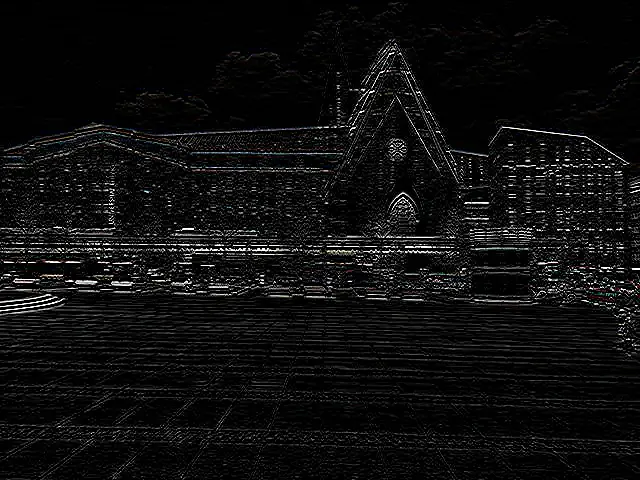
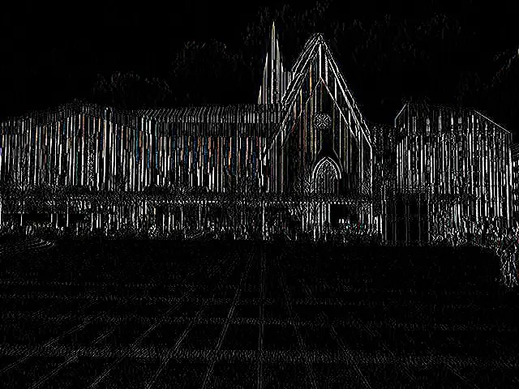

## Edge Detection Custom Kernel Filter in Java

<p align='justify'>
&nbsp;&nbsp;&nbsp;&nbsp;&nbsp;&nbsp;&nbsp;&nbsp;
The custom kernel filter designed for edge detection bears a resemblance to the <a href="../sharpen-filter/">Sharpen filter</a>, with a notable difference: the sum of all matrix elements is set to zero. As a result, the generated image appears nearly black overall, except for pixels that exhibit variations from their neighboring counterparts. Typically, these deviating pixels are located at the boundaries between different regions or edges.
</p>

<p align='justify'>
&nbsp;&nbsp;&nbsp;&nbsp;&nbsp;&nbsp;&nbsp;&nbsp;
In this example, the central pixel value is compared to its surrounding pixels in horizontal and vertical directions.
</p>

```java
// horizontal edge detection
{
    { 0, 0, -1, 0, 0,},
    { 0, 0, -1, 0, 0,},
    { 0, 0,  4, 0, 0,},
    { 0, 0, -1, 0, 0,},
    { 0, 0, -1, 0, 0,},
};
```

```java
// vertical edge detection
{
    { 0,  0,  0,  0,  0,},
    { 0,  0,  0,  0,  0,},
    { -1, -1, 4, -1, -1,},
    { 0,  0,  0,  0,  0,},
    { 0,  0,  0,  0,  0,},
};
```

<p align='justify'>
&nbsp;&nbsp;&nbsp;&nbsp;&nbsp;&nbsp;&nbsp;&nbsp;
Eventually, the application of the filter leads to preserving solely the outlines of the image set against a black background.
</p>

<style>
   .frame {
    border: 2px solid darkgray;
    padding: 5px;
    margin: 10px 0 5px 5px;
    background: #f0f0f0;
    align-items: center;
   }
   .marginauto {
    margin: 10px auto 20px;
    display: block;
   }
   .frame figcaption {
    margin: 0 auto;
    display: flex;
    flex-direction: row;
    justify-content: center;
   }
   .container {
    display: flex;
    flex-direction: row;
    align-items: center;
    justify-content: space-around;
   }
</style>

<figure class="frame">
<div class="container">
    <div>
        <figcaption>Horizontal edges</figcaption>
    </div>
    <div>
        <figcaption>Vertical edges</figcaption>
    </div>
</div>
<div class="container">
    <div>
        
    </div>
    <div>
        
    </div>
</div>
<figcaption>Edge detection kernel filter</figcaption>
</figure>

## Java code example

<p align='justify'>
&nbsp;&nbsp;&nbsp;&nbsp;&nbsp;&nbsp;&nbsp;&nbsp;
The provided Java code example demonstrates how to utilize the Aspose.Imaging for Java API. Utilize the `ConvolutionFilter` class, which provides pre-defined kernel filters, along with a <strong>custom kernel</strong> matrix. In this scenario, templates in PNG and SVG formats are loaded from the "templates" folder, and a set of filters are applied from a predefined list.
</p>


