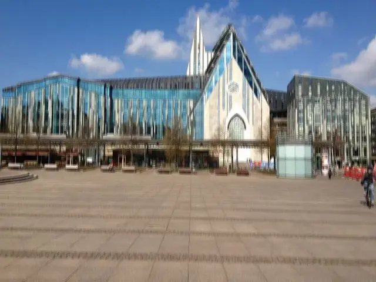

## Motion Blur Custom Kernel Filter in Java

<p align='justify'>
&nbsp;&nbsp;&nbsp;&nbsp;&nbsp;&nbsp;&nbsp;&nbsp;
You can choose to create a custom kernel with elements arranged, for example, in a vertical orientation. In this situation, the pixel value is computed based on the weighted average of these pixels, resulting in the 'Motion Blur' image effect. Higher weights assigned to elements have a more pronounced impact on the final pixel value in the Motion Blur image effect. Ensuring the total sum of elements is equal to 1 helps preserve the original image's brightness. The ability to position elements in different directions provides flexibility for generating various motion effects in the image.
</p>

```java
// custom vertical MotionBlur 5x5 kernel
{
  { 0, 0, 0.25, 0, 0 },
  { 0, 0, 0.2,  0, 0 },
  { 0, 0, 0.1,  0, 0 },
  { 0, 0, 0.2,  0, 0 },
  { 0, 0, 0.25, 0, 0 },
};
```
<p align='justify'>
&nbsp;&nbsp;&nbsp;&nbsp;&nbsp;&nbsp;&nbsp;&nbsp;
This effect emulates the visual impression of camera movement occurring during photo capture in a vertical direction. It generates the illusion of motion within the image.
</p>

<style>
   .frame {
    border: 2px solid darkgray;
    padding: 5px;
    margin: 10px 0 5px 5px;
    background: #f0f0f0;
    align-items: center;
   }
   .marginauto {
    margin: 10px auto 20px;
    display: block;
   }
   .frame figcaption {
    margin: 0 auto;
    display: flex;
    flex-direction: row;
    justify-content: center;
   }
   .container {
    display: flex;
    flex-direction: row;
    align-items: center;
    justify-content: space-around;
   }
</style>

<figure class="frame">
<div class="container">
    <div>
        <figcaption>Original image</figcaption>
    </div>
    <div>
        <figcaption>MotionBlur filter</figcaption>
    </div>
</div>
<div class="container">
    <div>
        
    </div>
    <div>
        
    </div>
</div>
<figcaption>Custom MotionBlur kernel filter</figcaption>
</figure>


## Java code example

<p align='justify'>
&nbsp;&nbsp;&nbsp;&nbsp;&nbsp;&nbsp;&nbsp;&nbsp;
The provided Java code example illustrates the application of the Aspose.Imaging for Java API. Utilize the `ConvolutionFilter` class, which provides pre-defined kernel filters, including the <strong>GetBlurMotion()</strong> method with adjustable size and angle settings. Furthermore, you retain the flexibility to craft your personalized kernel matrix. Within this example, image templates in PNG and SVG formats are loaded from the "templates" folder, and a set of filters are applied from a predefined list.
</p>


