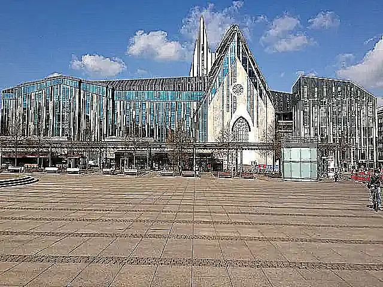

## Sharpen Kernel Filter in Java

<p align='justify'>
&nbsp;&nbsp;&nbsp;&nbsp;&nbsp;&nbsp;&nbsp;&nbsp;
To achieve a Sharpen image effect, formulate a kernel matrix that amplifies pixel values in relation to their surroundings. In this instance, the central element is attributed a value nine times higher than its surroundings, with a subtraction applied for the eight adjacent pixels. This setup ensures that the total sum of coefficients remains at 1, thereby preserving the original brightness. The impact is more noticeable when neighboring pixels exhibit variations, accentuating the contrast between pixels and augmenting the sharpness of the image.
</p>

```java
// sharpen 3x3 custom kernel
{
    { -1, -1, -1,},
    { -1,  9, -1,},
    { -1, -1, -1,},
};
```

<p align='justify'>
&nbsp;&nbsp;&nbsp;&nbsp;&nbsp;&nbsp;&nbsp;&nbsp;
The Sharpen effect enhances an image by highlighting pixel contrasts, leading to improved image detail and overall visual clarity.
</p>

<style>
   .frame {
    border: 2px solid darkgray;
    padding: 5px;
    margin: 10px 0 5px 5px;
    background: #f0f0f0;
    align-items: center;
   }
   .marginauto {
    margin: 10px auto 20px;
    display: block;
   }
   .frame figcaption {
    margin: 0 auto;
    display: flex;
    flex-direction: row;
    justify-content: center;
   }
   .container {
    display: flex;
    flex-direction: row;
    align-items: center;
    justify-content: space-around;
   }
</style>

<figure class="frame">
<div class="container">
    <div>
        <figcaption>Original image</figcaption>
    </div>
    <div>
        <figcaption>Sharpen image</figcaption>
    </div>
</div>
<div class="container">
    <div>
        
    </div>
    <div>
        
    </div>
</div>
<figcaption>Sharpen kernel filter</figcaption>
</figure>

## Java code example

<p align='justify'>
&nbsp;&nbsp;&nbsp;&nbsp;&nbsp;&nbsp;&nbsp;&nbsp;
The provided Java code example demonstrates the utilization of the Aspose.Imaging for Java API. Utilize the `ConvolutionFilter` class, which provides pre-defined kernel filters, including "Sharpen3x3" and "Sharpen5x5," each with different kernel matrix sizes. Moreover, you retain the flexibility to craft your custom kernel matrix. Within this example, image templates in PNG and SVG formats are loaded from the "templates" folder, and a set of filters are applied from a predefined list.
</p>


