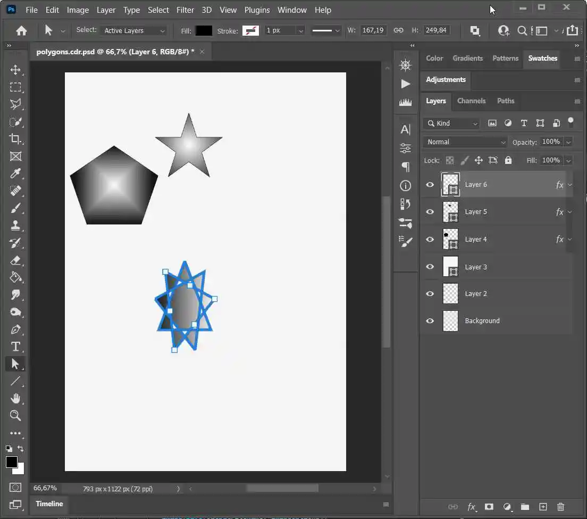

**Issue**: How to convert vector image to vectorized PSD image.

**Tips**: Starting from 22.3 release Aspose.Imaging library supports the conversion of vector images to vectorized PSD images.

## Preserving Vector Integrity: Convert Vector Images to PSD Format

&nbsp;&nbsp;&nbsp;&nbsp;&nbsp;&nbsp;&nbsp;&nbsp;
In the realm of digital graphics, vector images stand apart from their raster counterparts due to their unique composition. Unlike raster images, which are defined by individual pixels and their colors, vector images consist of graphical objects such as lines, shapes, and fills, defined by mathematical coordinates and properties. This fundamental difference grants vector images the advantage of scalability without loss of quality, making them ideal for tasks requiring precise rendering and resizing.

&nbsp;&nbsp;&nbsp;&nbsp;&nbsp;&nbsp;&nbsp;&nbsp;
However, while vector images excel in flexibility and scalability, they are often converted to raster formats like JPEG or PNG for practical web publishing purposes. Yet, there are scenarios where preserving the vector properties of an image is paramount, especially when transitioning between graphic editors or retaining the ability to scale and edit graphical elements with precision.

&nbsp;&nbsp;&nbsp;&nbsp;&nbsp;&nbsp;&nbsp;&nbsp;
In response to this need, Aspose.Imaging emerges as a powerful solution, offering seamless export capabilities for vector images to PSD format while maintaining their vector integrity. With support for vector image formats such as CDR, EMF, EPS, ODG, SVG, and WMF, Aspose.Imaging ensures that graphic objects and their properties remain intact throughout the conversion process.

### Key Features

- **Preservation of Vector Properties**: Aspose.Imaging leverages the PSD format's inherent support for vector elements, including Shapes, Paths, and Vector Masks, to faithfully preserve the original vector properties of the image.

- **Seamless Export Process**: Exporting vector images to PSD format with Aspose.Imaging is a straightforward process, requiring minimal effort while ensuring maximum fidelity to the original image.

- **Optimized Workflow**: By retaining vector properties during conversion, Aspose.Imaging facilitates a smooth transition between graphic editing software, allowing users to seamlessly edit and manipulate vector images in programs like Photoshop.

&nbsp;&nbsp;&nbsp;&nbsp;&nbsp;&nbsp;&nbsp;&nbsp;
While the current version of Aspose.Imaging primarily supports the export of relatively simple vector shapes, future releases will expand upon this foundation to include support for more complex features such as texture brushes and open shapes with strokes. This commitment to continuous improvement ensures that users can expect even greater versatility and functionality from Aspose.Imaging in the future.

### C# Code Example of Conversion Vector Image to Vectorized PSD

&nbsp;&nbsp;&nbsp;&nbsp;&nbsp;&nbsp;&nbsp;&nbsp;
Converting vector images from CorelDraw to Photoshop PSD format while retaining vector properties is simple with the following steps:

Begin by loading your source vector image using the `Load()` method. Then, save it as a PSD format using <a href="https://reference.aspose.com/imaging/net/aspose.imaging.imageoptions/psdoptions/">PsdOptions() class</a> with the <a href="https://reference.aspose.com/imaging/net/aspose.imaging.fileformats.psd/vectordatacompositionmode/">VectorDataCompositionMode enumeration</a> set to `SeparateLayers` option to export the content as separate layers.



### Editing exported vector files in Photoshop PSD format

&nbsp;&nbsp;&nbsp;&nbsp;&nbsp;&nbsp;&nbsp;&nbsp;
After exporting vector files, such as CDR format, to PSD using Aspose.Imaging, you will be able to leverage all the benefits of their preserved vector properties. Each shape is separated into individual layers, facilitating easy editing. In Photoshop, access the desired shape layer from the Layers panel. Use tools like the Move tool or Shape tools to modify the shape as required. Adjust color, size, or position as needed.

<figure class="frame">

    
<figcaption>Edit shapes in a PSD file exported from CDR format</figcaption>

</figure>

&nbsp;&nbsp;&nbsp;&nbsp;&nbsp;&nbsp;&nbsp;&nbsp;
In conclusion, Aspose.Imaging stands as a reliable solution for exporting vector images to PSD format while upholding their vector integrity. Whether for professional graphic design projects or personal creative endeavors, Aspose.Imaging empowers users to preserve the precision and flexibility of vector graphics, unlocking new possibilities in graphic processing and manipulation.

