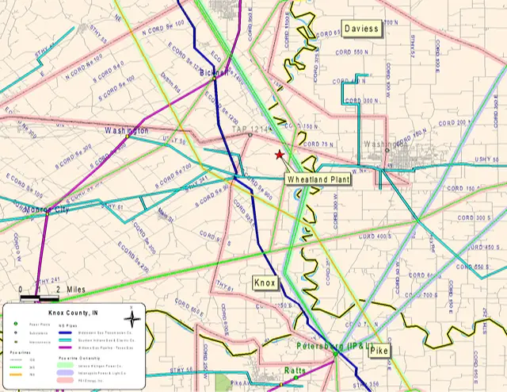
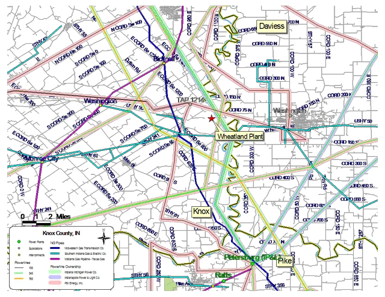

## Removing Background from Vector Images

&nbsp;&nbsp;&nbsp;&nbsp;&nbsp;&nbsp;&nbsp;&nbsp;
Removing backgrounds from images is a crucial task, not only for raster images but also for vector images. With the Aspose.Imaging Python API, you can seamlessly perform background removal for vector images like WMF or SVG, saving the results in the same image format or converting them to other formats, including raster images.

&nbsp;&nbsp;&nbsp;&nbsp;&nbsp;&nbsp;&nbsp;&nbsp;
Processing vector images differs from raster formats. In vector files, the background may consist of multiple color-filled shapes covering the entire image, overlapping with foreground shapes or paths. In the Aspose.Imaging library, shapes without underlined paths are considered the background. Furthermore, you can specify a background color to be removed from the image and exclude foreground objects of the same color from removal. Additionally, you have the flexibility to choose a specific area of the image for background removal. The removed background can then be replaced with another color or left transparent.

### WMF vector image example

&nbsp;&nbsp;&nbsp;&nbsp;&nbsp;&nbsp;&nbsp;&nbsp;
Below is an example of a Windows Metafile (WMF) vector image featuring a map drawing. The original file had its background removed, resulting in an image with a transparent background:

<figure class="frame">

    

        <figcaption>Original image</figcaption>
    

    

        <figcaption>Resulting image</figcaption>
    

    

        
    

    

        
    

<figcaption>Removing background from WMF vector image</figcaption>
</figure>

### Python code example

&nbsp;&nbsp;&nbsp;&nbsp;&nbsp;&nbsp;&nbsp;&nbsp;
The Python code example below demonstrates the image processing for background removal. To automate this process for vector images, you can list all the desired source file names and specify the <a href="https://reference.aspose.com/imaging/python-net/aspose.imaging/removebackgroundsettings/">`RemoveBackgroundSettings`</a> for each. Then, pass these file lists and settings to the function, and utilize the <a href="https://reference.aspose.com/imaging/python-net/aspose.imaging/vectorimage/#remove_background_settings_29">`removeBackground()` method</a>. The resulting images in this example are saved in the PNG raster image format with a transparent background:


