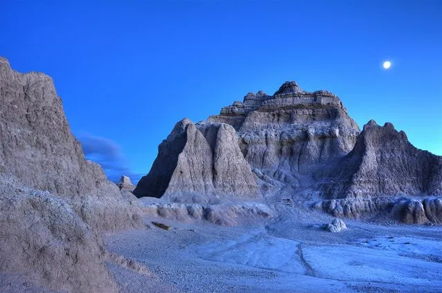
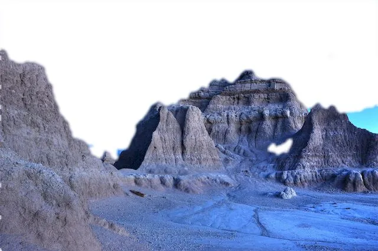
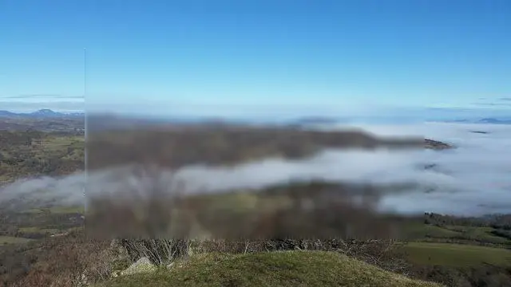
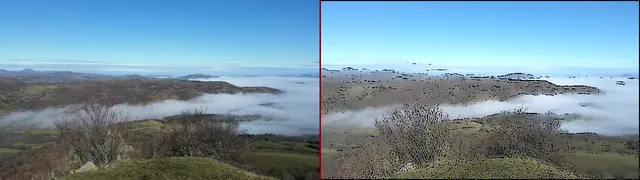
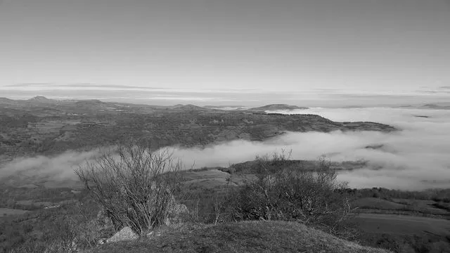
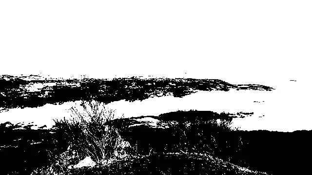
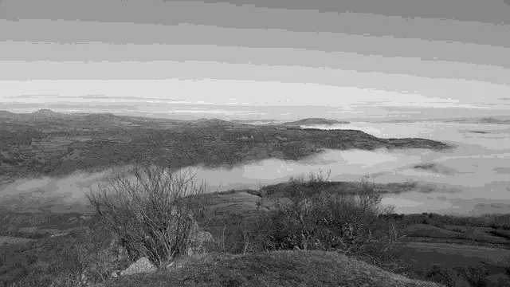

## How to edit your photo or image programmatically

&nbsp;&nbsp;&nbsp;&nbsp;&nbsp;&nbsp;&nbsp;&nbsp;
Just as an eye-catching book cover often guarantees success among buyers, a well-crafted website is a guarantee of high attendance. Just as a potential reader wouldn't want to miss a publication after observing its cover on a store shelf, every element should be in harmony: the design, illustrations, well-chosen color palette, and appropriate fonts. The more attentive we are in selecting and processing images on a web page, the greater the likelihood that users will favor it. However, today's fast-paced lifestyle and intensifying competition set increasingly high benchmarks for material quality and efficiency. Equipped with a toolkit for image editing, you can enhance a website's appeal, leading to increased organic traffic.

&nbsp;&nbsp;&nbsp;&nbsp;&nbsp;&nbsp;&nbsp;&nbsp;
Automating repetitive image editing tasks accelerates the process of preparing pictures for subsequent use, whether it's for a book illustration, a website, or a scientific research project. For instance, you can simultaneously apply filters like noise reduction or image smoothing to multiple files. The Aspose.Imaging software library for Java provides a comprehensive toolkit for image processing. Aspose.Imaging enables the creation of diverse web services, such as generating collages from multiple images or applying cartoonify effects to inspire pictures with an animated film style.

&nbsp;&nbsp;&nbsp;&nbsp;&nbsp;&nbsp;&nbsp;&nbsp;
This article explains the practical use of highly efficient image editing tools provided by Aspose.Imaging Java library. Refer to the linked list of the <a href="https://docs.aspose.com/imaging/java/supported-file-formats/">supported image formats</a> to explore the full possibilities.

### Resizing an image

&nbsp;&nbsp;&nbsp;&nbsp;&nbsp;&nbsp;&nbsp;&nbsp;
Before publishing images on a website, it usually needs to prepare the initial images for various web presentation scenarios. For a photo gallery, thumbnails with smaller image dimensions are required, for photo previews, images need to be resized to medium sizes, and for detailed views, larger sizes are necessary. With the Aspose.Imaging library, executing an image resizing procedure for multiple files is straightforward, allowing you to generate a collection of images in the required sizes.

Java code example: [howto resize image](resize-image).

### Crop an image

&nbsp;&nbsp;&nbsp;&nbsp;&nbsp;&nbsp;&nbsp;&nbsp;
In certain situations, images may have key subjects or specific individuals in photos that you want to isolate and position in the central region of the image. You can define a rectangular area for this designated area and achieve this image cropping using the methods provided by the Aspose.Imaging library.

Java code example: [howto crop image](crop-image).

### Rotate

&nbsp;&nbsp;&nbsp;&nbsp;&nbsp;&nbsp;&nbsp;&nbsp;
You might have a collection of images that you wish to rotate to a precise angle, either clockwise or counterclockwise. This could be necessary when a horizontal line within photos has an undesirable tilt. With the assistance of the Aspose.Imaging library, you can easily rotate images to any desired angle.

Java code example: [howto rotate image](rotate-image).

&nbsp;&nbsp;&nbsp;&nbsp;&nbsp;&nbsp;&nbsp;&nbsp;
The more examples, how to resize, crop and rotate images you can find in the [Aspose.Imaging Developer's guide](https://docs.aspose.com/imaging/java/crop-rotate-and-resize-images/).

### Remove background

&nbsp;&nbsp;&nbsp;&nbsp;&nbsp;&nbsp;&nbsp;&nbsp;
Sometimes you need to remove a background from a photo and leave only human’s figures or other objects on a white field. Removing a picture background or photo background change are more complicated tasks than the basic image manipulations mentioned above. With Aspose.Imaging library you can effectively remove or change a photo background and embeds the library into your photo background editor application. The image library can automatically mask background pixels and set them to zero (white color) or another color. Additionally Imaging.Cloud API can be used for improving masking results. The Cloud API is used for detecting objects on a photo and applying detected objects’ bounds to the image more precisely.

Original image:

Image with removed background:

Java code example: [howto remove background](remove-background).

### Filter an image

&nbsp;&nbsp;&nbsp;&nbsp;&nbsp;&nbsp;&nbsp;&nbsp;
Applying filters to images is a very popular operation of image quality enhancement. You may need to filter a photo to make it more sharp or on the contrary, blur them. You can quickly apply several filters using the Java program. Aspose.Imaging proposes a list of available filters for smoothing images with noise reduction, but preserving objects’ edges, changing brightness and contrast for reducing overexposure of photography or lightening too dark parts, and emphasizing details.

Original image:

Image with Gauss blur filter:

Java code example: [howto filter image](filter-image).

### Merge images

&nbsp;&nbsp;&nbsp;&nbsp;&nbsp;&nbsp;&nbsp;&nbsp;
To combine several images into one image, you can use methods from the image library. It is possible to merge images by adding them to the resulting image in horizontal or vertical directions. This approach is suitable for creating large images, like wallpaper, consisting of many repeated small ones or you can create a collage from several different images.

Merged two images info one collage:

Java code example: [howto merge images](merge-images).

### Grayscale image

&nbsp;&nbsp;&nbsp;&nbsp;&nbsp;&nbsp;&nbsp;&nbsp;
Some images may look more interesting in grayscale format rather than in color. The colors in photography may not contain valuable information, but a black&white style could emphasize lights and shadows, attract attention to surface details, and create more emotional responses. The `Grayscale` method of Aspose.Imaging converts color images to it grayscale representation.

Grayscaled image example:

Java code example: [howto grayscale image](grayscale-image).

### Binarize image

&nbsp;&nbsp;&nbsp;&nbsp;&nbsp;&nbsp;&nbsp;&nbsp;
Another technique to convert color images to black and white is to binarize them. It means that each pixel of the image will be substituted to value 0 or 1 (white or black color) depending on the indicated threshold. The binarization useful for printing pictures in one black color without tint graduation. With the image library, you can select between fixed thresholds, use the average threshold value calculated from the neighbor pixels area with the `Bradley` method or automatically choice a threshold with the `Otsu` method.

Example of black and image with binarization threshold 100:

Java code example: [howto binarize image](binarize-image).

### Dither image

&nbsp;&nbsp;&nbsp;&nbsp;&nbsp;&nbsp;&nbsp;&nbsp;
Image dithering is used for adding some noise to pictures. This method can increase image quality after reducing the color palette for publishing on the web and creating a trilling visual effect. With the Aspose image library, you use the simple `Threshold` method or the more complex `FloydSteinberg` method, which uses nearest neighbors’ pixels intensity values for dithering.

Example of image with `FloydSteinberg` dither method applied:

Java code example: [howto dither image](dither-image).

### Adjust image

&nbsp;&nbsp;&nbsp;&nbsp;&nbsp;&nbsp;&nbsp;&nbsp;
Adjusting image brightness, contrast and gamma are often used operations for image editing before publishing. Pictures may look pale or different areas of the image could be too darkened or too lighten without properly adjusting these parameters. These image defects lead to picture details loss and the general effect of a website with such images will be weak. You can perform brightness, contrast or gamma correction by passing appropriate parameters to the image library method.

Java code example: [howto adjust image](adjust-image).

### Cartoonify image

&nbsp;&nbsp;&nbsp;&nbsp;&nbsp;&nbsp;&nbsp;&nbsp;
Also, you can combine several image editing techniques and create new sophisticated visual effects, for example, the effect of a cartoon image. Cartoon-style images will decorate your publication and attract more users. The example below sequentially uses a list of methods such as `AdjustBrightness`, `BinarizeFixed`, `Filter`, `ReplaceColor`, `ApplyMask` and others applied to the original loaded images.

Example of image with `Cartoonify` filter applied:

Java code example: [howto cartoonify image](cartoonify-image).

### Drawing images

&nbsp;&nbsp;&nbsp;&nbsp;&nbsp;&nbsp;&nbsp;&nbsp;
You can not only edit existing images but create new ones and draw various shapes such as Lines, Ellipses, Rectangles, Arcs and Bezier shapes. First, you need to create an image surface with selected background color, then select a tool Pen to draw with a specific brush, color and width.

Java code example: [howto drawing images](draw-image).

## How to edit your photo or image online

&nbsp;&nbsp;&nbsp;&nbsp;&nbsp;&nbsp;&nbsp;&nbsp;
Finally, if you want to try a demo you can edit your pictures online. In case you need to edit only one photo or image, or you need to quickly apply filters to improve your photo, you can use Aspose online photo editing app as a free photo editor. Unlike paid versions of graphic editors, you can edit your photos in a web browser on Aspose website for free. With an online image editor, it is possible to make all common operations with your images. Open <a href="https://products.aspose.app/imaging/image-editor">Online image editor</a> in your browser and upload your image file from a local PC by drag-and-drop or upload an image from your Google or DropBox account into an active image editor area in your browser window. In the online editor, you can crop the image by selecting an arbitrary rectangle area or by selecting an area with a predefined sides ratio. Also, you can resize an image to a specific width and height or just indicate the scaling in percentages with keeping or not aspect ratio. Rotating and flipping images are available as well. You can rotate an image on a specific angle fitting to the canvas or cut edges after rotation.

&nbsp;&nbsp;&nbsp;&nbsp;&nbsp;&nbsp;&nbsp;&nbsp;
There are dozen of filters available on the <a href="https://products.aspose.app/imaging/photo-filter">Online photo editor</a>, including adjusting Brightness and Contrast, Gamma corrections, Grayscale, Binarize, Blur, Sharpen and Cartoon filters. After editing the image and applying filters you can save and download the resulting image using 20 available different popular image formats like `pdf`, `jpeg`, `gif`, `png` or `bmp`. You can check Aspose.Imaging program library functionality and quality by trying these online image editors, and decide to order a license for the Aspose.Imaging local usage to create your applications and services.

## Conclusion

&nbsp;&nbsp;&nbsp;&nbsp;&nbsp;&nbsp;&nbsp;&nbsp;
Aspose.Imaging program library helps you to edit images and photos and facilitates the development of graphic manipulating applications and services. The image library provides you ready to use program methods to process images in your own way. Free online photo and images editor with photo filter is available at your convenience where you can try the most popular image editing operations and save the results in many image formats.

