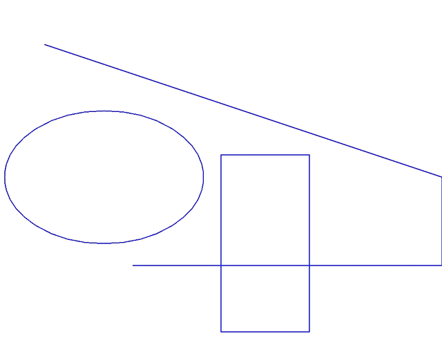

## How to draw an image

&nbsp;&nbsp;&nbsp;&nbsp;&nbsp;&nbsp;&nbsp;&nbsp;
There are several Aspose.Imaging library methods to draw graphics primitives such as
<a href="https://reference.aspose.com/imaging/java/com.aspose.imaging/graphics/#drawLine-com.aspose.imaging.Pen-int-int-int-int-">DrawLine</a>,
<a href="https://reference.aspose.com/imaging/java/com.aspose.imaging/graphics/#drawEllipse-com.aspose.imaging.Pen-com.aspose.imaging.RectangleF-">DrawEllipse</a>,
<a href="https://reference.aspose.com/imaging/java/com.aspose.imaging/graphics/#drawRectangle-com.aspose.imaging.Pen-int-int-int-int-">DrawRectangle</a>,
<a href="https://reference.aspose.com/imaging/java/com.aspose.imaging/graphics/#drawArc-com.aspose.imaging.Pen-com.aspose.imaging.RectangleF-float-float-">DrawArc</a>,
<a href="https://reference.aspose.com/imaging/java/com.aspose.imaging/graphics/#drawBezier-com.aspose.imaging.Pen-com.aspose.imaging.PointF-com.aspose.imaging.PointF-com.aspose.imaging.PointF-com.aspose.imaging.PointF-">DrawBezier</a> and
<a href="https://reference.aspose.com/imaging/java/com.aspose.imaging/graphics/#drawString-java.lang.String-com.aspose.imaging.Font-com.aspose.imaging.Brush-float-float-">DrawString</a>.
Before drawing a first element, you need to create a graphic canvas to draw an image from scratch and define its properties. We create a surface of 100 x 100 pixels with a depth of 32 bits per pixel and use a yellow color background by utilizing the <a href="https://reference.aspose.com/imaging/java/com.aspose.imaging/graphics/#clear-com.aspose.imaging.Color-">Clear method</a>. To define a drawing tool, we will use an object Pen with a Blue color, to draw a dotted line or use SolidBrush for continuous lines, followed by coordinates of the start and end points of the lines:



&nbsp;&nbsp;&nbsp;&nbsp;&nbsp;&nbsp;&nbsp;&nbsp;
Please find more examples of drawing lines, ellipses, rectangles, arcs, Bezier curves and text strings in the <a href="https://docs.aspose.com/imaging/java/drawing-images/">Aspose drawing images guide</a>.

The image example below demonstrates lines, ellipses and rectangles drawings on a transparent background:

