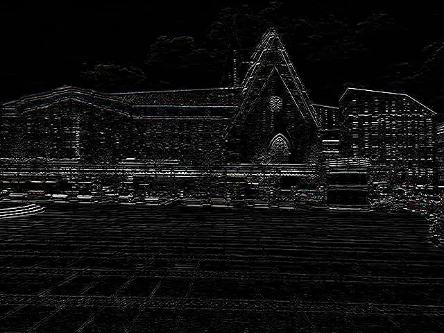

## Kernel Filters


Identical:
```java
{
    { 0, 0, 0,},
    { 0, 1, 0,},
    { 0, 0, 0,},
};
```

<style>
   .frame {
    border: 2px solid darkgray;
    padding: 5px;
    margin: 10px 0 5px 5px;
    background: #f0f0f0;
    align-items: center;
   }
   .marginauto {
    margin: 10px auto 20px;
    display: block;
   }
   .frame figcaption {
    margin: 0 auto;
    display: flex;
    flex-direction: row;
    justify-content: center;
   }
</style>


<figure class="frame"><p>
    
<figcaption>Original building photo</figcaption>
</p></figure>

Sharpen 3x3:
```java
{
    {  0, -1,  0 },
    { -1,  5, -1 },
    {  0, -1,  0 },
};
```

<figure class="frame"><p>
    
<figcaption>Sharpen kernel filter</figcaption>
</p></figure>


Edge detection:
```java
// vertical edge detection
{
    { 0,  0,  0,  0,  0,},
    { 0,  0,  0,  0,  0,},
    { -1, -1, 4, -1, -1,},
    { 0,  0,  0,  0,  0,},
    { 0,  0,  0,  0,  0,},
};
```


<figure class="frame"><p>
    
<figcaption>Vertical edges kernel filter</figcaption>
</p></figure>

```java
// horizontal edge detection
{
    { 0, 0, -1, 0, 0,},
    { 0, 0, -1, 0, 0,},
    { 0, 0,  4, 0, 0,},
    { 0, 0, -1, 0, 0,},
    { 0, 0, -1, 0, 0,},
};
```

<figure class="frame"><p>
    
<figcaption>Horizontal edges kernel filter</figcaption>
</p></figure>
