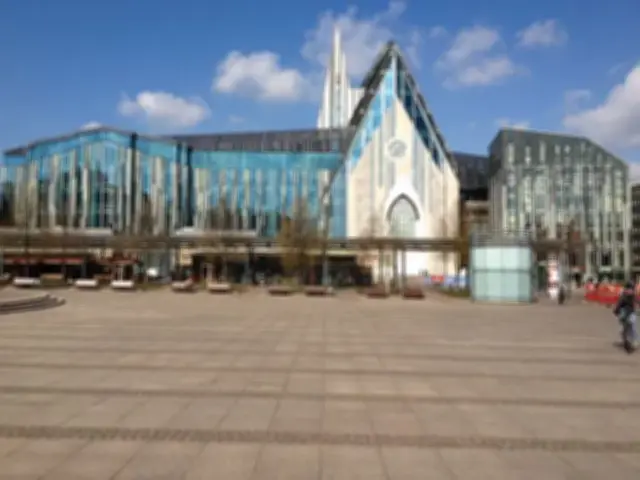

## Blur Box Kernel Filter in Java

<p align='justify'>
&nbsp;&nbsp;&nbsp;&nbsp;&nbsp;&nbsp;&nbsp;&nbsp;
By setting the average value of a 3x3 pixel neighborhood, you can fill the kernel matrix with uniform elements, ensuring a cumulative sum of 1. The resulting pixel value is calculated by summing up 1/9 of the values from all adjacent pixels. This specific kernel matrix is commonly identified as a `Blur Box`. The blurring effect can be heightened by enlarging the matrix dimensions.
</p>

```java
// Blur Box 3x3 kernel
{
  { 0.111, 0.111, 0.111 },
  { 0.111, 0.111, 0.111 },
  { 0.111, 0.111, 0.111 },
};
```
<p align='justify'>
&nbsp;&nbsp;&nbsp;&nbsp;&nbsp;&nbsp;&nbsp;&nbsp;
This procedure leads to a gradual shift in pixel values between neighboring elements, effectively inducing a blur in the image. It aids in noise reduction, diminishes sharpness, and produces a soft, indistinct appearance.
</p>

<style>
   .frame {
    border: 2px solid darkgray;
    padding: 5px;
    margin: 10px 0 5px 5px;
    background: #f0f0f0;
    align-items: center;
   }
   .marginauto {
    margin: 10px auto 20px;
    display: block;
   }
   .frame figcaption {
    margin: 0 auto;
    display: flex;
    flex-direction: row;
    justify-content: center;
   }
   .container {
    display: flex;
    flex-direction: row;
    align-items: center;
    justify-content: space-around;
   }
</style>

<figure class="frame">
<div class="container">
    <div>
        <figcaption>Original image</figcaption>
    </div>
    <div>
        <figcaption>Blur filter</figcaption>
    </div>
</div>
<div class="container">
    <div>
        
    </div>
    <div>
        
    </div>
</div>
<figcaption>Blur Box kernel filter</figcaption>
</figure>

## Java code example

<p align='justify'>
&nbsp;&nbsp;&nbsp;&nbsp;&nbsp;&nbsp;&nbsp;&nbsp;
Illustrating the utilization of the Aspose.Imaging API for Java, the subsequent code example showcases the use of the `ConvolutionFilter` class. This class provides pre-defined kernel filters, including <strong>GetBlurBox()</strong> with adjustable size settings. Moreover, you retain the option to craft your personalized kernel matrix. In this instance, templates in PNG and SVG formats are loaded from the "templates" folder, and a set of filters is applied from a predefined list.
</p>


