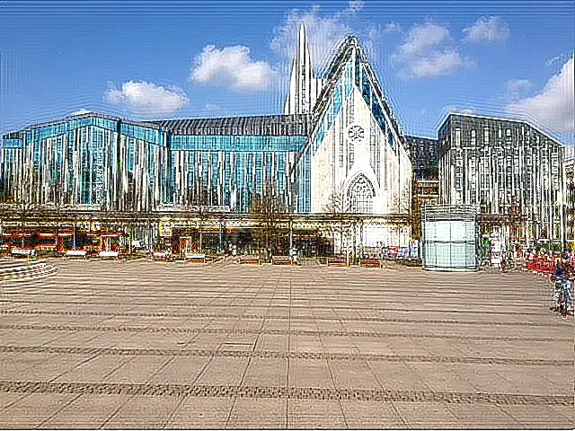

## Deconvolution Kernel Filter in Java

<p align='justify'>
&nbsp;&nbsp;&nbsp;&nbsp;&nbsp;&nbsp;&nbsp;&nbsp;
Deconvolution acts as the reverse matrix operation to a convolution filter. When a convolution transformation, like the application of a  <a href="../gaussian-blur-filter/">Gaussian blur kernel filter</a>, is performed, attempting to undo this operation cannot completely recover the original image. This limitation arises from the averaging of pixel values during convolution, leading to a loss of some details. Nevertheless, deconvolution holds significance in image restoration and deblurring processes.
</p>

<p align='justify'>
&nbsp;&nbsp;&nbsp;&nbsp;&nbsp;&nbsp;&nbsp;&nbsp;
In the given showcase, we first apply a Gaussian blur convolution filter and subsequently restore the original image using a Deconvolution filter:
</p>

```java
// gaussian 3x3 convolution kernel
{
  {1, 2, 1,},
  {2, 4, 2,},
  {1, 2, 1,},
};
```

```java
DeconvolutionFilterOptions(ConvolutionFilter.GetGaussian(Size, Sigma))
```
<p align='justify'>
&nbsp;&nbsp;&nbsp;&nbsp;&nbsp;&nbsp;&nbsp;&nbsp;
While the restored image may not precisely match the original, it does reveal more details following the deblurring process.
</p>

<style>
   .frame {
    border: 2px solid darkgray;
    padding: 5px;
    margin: 10px 0 5px 5px;
    background: #f0f0f0;
    align-items: center;
   }
   .marginauto {
    margin: 10px auto 20px;
    display: block;
   }
   .frame figcaption {
    margin: 0 auto;
    display: flex;
    flex-direction: row;
    justify-content: center;
   }
   .container {
    display: flex;
    flex-direction: row;
    align-items: center;
    justify-content: space-around;
   }
</style>

<figure class="frame">
<div class="container">
    <div>
        <figcaption>Original image</figcaption>
    </div>
    <div>
        <figcaption>Deconvolution filter</figcaption>
    </div>
</div>
<div class="container">
    <div>
        
    </div>
    <div>
        
    </div>
</div>
<figcaption>Deconvolution kernel filter</figcaption>
</figure>

## Java code example

<p align='justify'>
&nbsp;&nbsp;&nbsp;&nbsp;&nbsp;&nbsp;&nbsp;&nbsp;
The comprehensive Java code example provided below demonstrates the application of the Aspose.Imaging for Java API. Employ the `ConvolutionFilter` class with the "GetGaussian" blurring method and then proceed to deblur using the <strong>DeconvolutionFilterOptions</strong>. In this illustration, image templates in PNG and SVG formats are loaded from the "templates" folder, and filters are applied from a predefined list.
</p>


