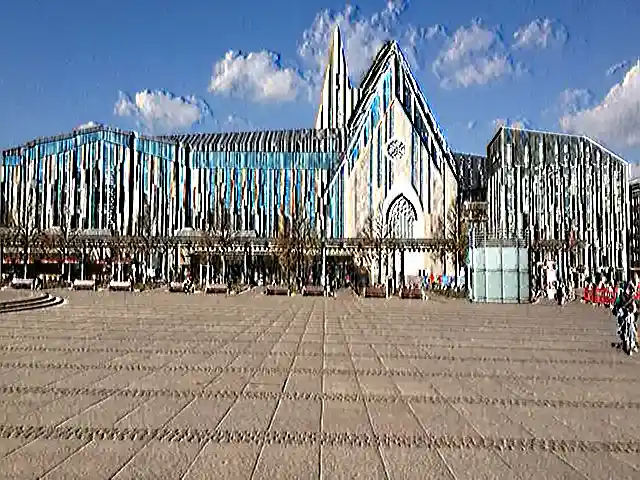

## Emboss Kernel Filter in Java

<p align='justify'>
&nbsp;&nbsp;&nbsp;&nbsp;&nbsp;&nbsp;&nbsp;&nbsp;
In this instance, we manipulate pixel values based on their adjacent counterparts. The resultant pixel values are proportionally reduced concerning the values of the left neighboring pixels and elevated by the surroundings on the right side. Substantially, brighter left pixels lead to a more significant decrease in value, while a brighter right pixel results in an increase in value. The maximum value of 255 denotes white, and 0 corresponds to black. If the outcome surpasses 255, it is capped at 255, and values below 0 are adjusted to 0. The total sum of all matrix coefficients remains constant at 1, ensuring that the overall brightness of the image remains consistent.
</p>

```java
// emboss3x3 custom kernel
{
    { -1,  0,  1, },
    { -2,  1,  2, },
    { -1,  0,  1, },
};
```

<p align='justify'>
&nbsp;&nbsp;&nbsp;&nbsp;&nbsp;&nbsp;&nbsp;&nbsp;
As a result, the visual enhancement of image edges and contours occurs, with excessive shadow from the dark side and increased light on the bright side. This particular image effect, recognized as the "Emboss" filter, imparts the impression of the image being embossed or raised from the background. The outcome creates a visual illusion of depth and texture.
</p>

<style>
   .frame {
    border: 2px solid darkgray;
    padding: 5px;
    margin: 10px 0 5px 5px;
    background: #f0f0f0;
    align-items: center;
   }
   .marginauto {
    margin: 10px auto 20px;
    display: block;
   }
   .frame figcaption {
    margin: 0 auto;
    display: flex;
    flex-direction: row;
    justify-content: center;
   }
   .container {
    display: flex;
    flex-direction: row;
    align-items: center;
    justify-content: space-around;
   }
</style>

<figure class="frame">
<div class="container">
    <div>
        <figcaption>Original image</figcaption>
    </div>
    <div>
        <figcaption>Emboss filter</figcaption>
    </div>
</div>
<div class="container">
    <div>
        
    </div>
    <div>
        
    </div>
</div>
<figcaption>Emboss 3x3 kernel filter</figcaption>
</figure>


## Java code example

<p align='justify'>
&nbsp;&nbsp;&nbsp;&nbsp;&nbsp;&nbsp;&nbsp;&nbsp;
The provided Java code example showcases the utilization of the Aspose.Imaging for Java API. Utilize the `ConvolutionFilter` class, which provides pre-defined kernel filters such as "Emboss3x3" and "Emboss5x5," each with distinct kernel matrix sizes. Moreover, you retain the flexibility to craft your personalized kernel matrix. Within this code snippet, image templates in PNG and SVG formats are loaded from the "templates" folder, and a set of filters are applied from a predefined list.
</p>


