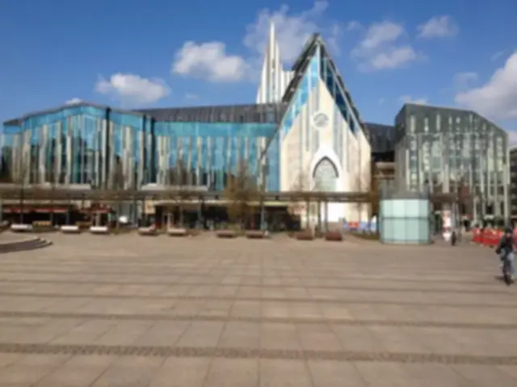

## Gaussian Blur Kernel Filter in Java

<p align='justify'>
&nbsp;&nbsp;&nbsp;&nbsp;&nbsp;&nbsp;&nbsp;&nbsp;
Diverging from typical <a href="../blur-filter/">Blur Box image filters</a>, which employ an averaging filter, the simple average applied to pixel values in a defined neighborhood results in a uniform and straightforward blurring effect. In such scenario, each pixel contributes equally to its neighboring pixels.

<p align='justify'>
&nbsp;&nbsp;&nbsp;&nbsp;&nbsp;&nbsp;&nbsp;&nbsp;
In contrast, Gaussian blur utilizes a Gaussian distribution to ascertain the weights of pixels within the neighborhood. This implies that pixels closer to the center hold higher weights, leading to a smoother and more natural blurring effect. To simulate the Gaussian distribution, the following 3x3 matrix can be employed:
</p>

```java
// gaussian blur 3x3 kernel matrix
{
  {1, 2, 1,},
  {2, 4, 2,},
  {1, 2, 1,},
};
```
<p align='justify'>
&nbsp;&nbsp;&nbsp;&nbsp;&nbsp;&nbsp;&nbsp;&nbsp;
To maintain the brightness of the source image, all elements are divided by 16, a value that corresponds to the sum of the matrix elements.
</p>

```java
// gaussian blur 3x3 kernel matrix /16
{
  { 0.0625, 0.125,  0.0625,},
  { 0.125,   0.25,   0.125,},
  { 0.0625, 0.125,  0.0625,},
};
```

<p align='justify'>
&nbsp;&nbsp;&nbsp;&nbsp;&nbsp;&nbsp;&nbsp;&nbsp;
Gaussian blur filter tends to yield a visually appealing and smooth result, surpassing the uniform blurring effect produced by blur box filters.
</p>

<style>
   .frame {
    border: 2px solid darkgray;
    padding: 5px;
    margin: 10px 0 5px 5px;
    background: #f0f0f0;
    align-items: center;
   }
   .marginauto {
    margin: 10px auto 20px;
    display: block;
   }
   .frame figcaption {
    margin: 0 auto;
    display: flex;
    flex-direction: row;
    justify-content: center;
   }
   .container {
    display: flex;
    flex-direction: row;
    align-items: center;
    justify-content: space-around;
   }
</style>

<figure class="frame">
<div class="container">
    <div>
        <figcaption>Original image</figcaption>
    </div>
    <div>
        <figcaption>Gaussian blur</figcaption>
    </div>
</div>
<div class="container">
    <div>
        
    </div>
    <div>
        
    </div>
</div>
<figcaption>Gaussian blur kernel filter</figcaption>
</figure>


## Java code example

<p align='justify'>
&nbsp;&nbsp;&nbsp;&nbsp;&nbsp;&nbsp;&nbsp;&nbsp;
The provided Java code example demonstrates the utilization of the Aspose.Imaging for Java API. Utilize the `ConvolutionFilter` class, which provides pre-defined kernel filters, including the <strong>GetGaussian()</strong> method with adjustable size and sigma value for the Gauss distribution. Moreover, you retain the flexibility to craft your personalized kernel matrix. Within this example, image templates in PNG and SVG formats are loaded from the "templates" folder, and a set of filters are applied from a predefined list.
</p>


