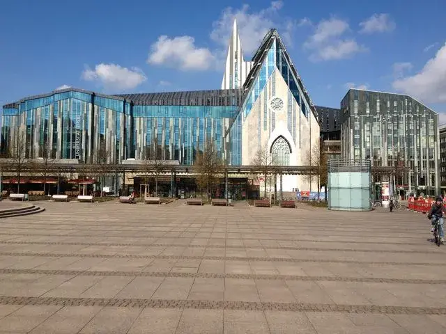
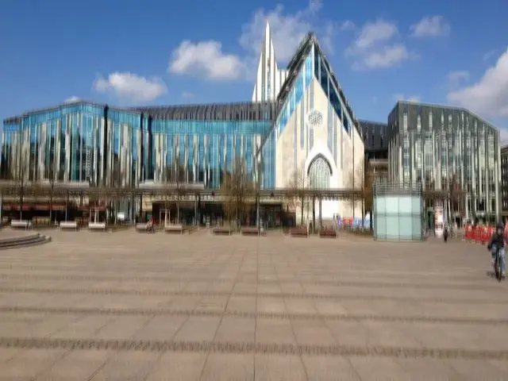

## Motion Blur Custom Kernel Filter

<p align='justify'>
&nbsp;&nbsp;&nbsp;&nbsp;&nbsp;&nbsp;&nbsp;&nbsp;
You have the option to design a custom kernel with elements positioned, for instance, exclusively along one diagonal. In such a scenario, the pixel value is determined by the weighted average of these pixels, producing the 'Motion Blur' image effect. Higher element weights contribute more to the final pixel value in the Motion Blur image effect. Maintaining a total sum of elements equal to 1 preserves the original picture's brightness. The flexibility to place elements in various directions allows for the creation of different movement effects in the image.
</p>

```cs
// custom MotionBlur 5x5 kernel
double[,] customKernel = new double[,]
{
  { 0, 0, 0.25, 0, 0 },
  { 0, 0, 0.2,  0, 0 },
  { 0, 0, 0.1,  0, 0 },
  { 0, 0, 0.2,  0, 0 },
  { 0, 0, 0.25, 0, 0 },
};
{
  { 0,    0,    0,    0,    0   },
  { 0,    0,    0,    0,    0   },
  { 0.25, 0.2,  0.1,  0.2, 0.25 },
  { 0,    0,    0,    0,    0   },
  { 0,    0,    0,    0,    0   },
};
```
<p align='justify'>
&nbsp;&nbsp;&nbsp;&nbsp;&nbsp;&nbsp;&nbsp;&nbsp;
This effect simulates the appearance of camera movement during photo capture in a diagonal direction, creating the illusion of motion in the image.
</p>

<style>
   .frame {
    border: 2px solid darkgray;
    padding: 5px;
    margin: 10px 0 5px 5px;
    background: #f0f0f0;
    align-items: center;
   }
   .marginauto {
    margin: 10px auto 20px;
    display: block;
   }
   .frame figcaption {
    margin: 0 auto;
    display: flex;
    flex-direction: row;
    justify-content: center;
   }
   .container {
    display: flex;
    flex-direction: row;
    align-items: center;
    justify-content: space-around;
   }
</style>

<figure class="frame">
<div class="container">
    <div>
        <figcaption>Original image</figcaption>
    </div>
    <div>
        <figcaption>MotionBlur filter</figcaption>
    </div>
</div>
<div class="container">
    <div>
        
    </div>
    <div>
        
    </div>
</div>
<figcaption>Custom MotionBlur kernel filter</figcaption>
</figure>


## Java code example

<p align='justify'>
&nbsp;&nbsp;&nbsp;&nbsp;&nbsp;&nbsp;&nbsp;&nbsp;
The following Java code example shows the usage of the Aspose.Imaging .NET API. You can employ the `ConvolutionFilter` class, which offers predefined kernel filters <strong>GetBlurMotion()</strong> with adjustable size and angle settings. Additionally, you have the flexibility to create your custom kernel matrix. In this example, image templates in PNG and SVG formats are loaded from the "templates" folder, and filters are applied from a predefined list.
</p>


