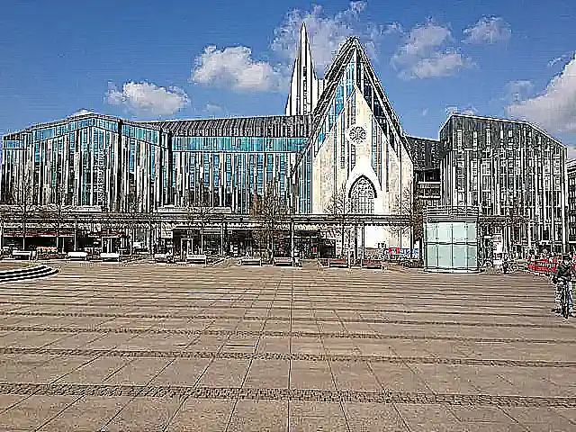

## Sharpen Kernel Filter

<p align='justify'>
&nbsp;&nbsp;&nbsp;&nbsp;&nbsp;&nbsp;&nbsp;&nbsp;
To reach a Sharpen image effect, define a kernel matrix that intensifies pixel values relative to their surroundings. In this example, the central element is assigned a value five times that of its surroundings, with a subtraction made for the four adjacent pixels (upper, down, left, and right). This ensures that the total sum of coefficients remains at 1, preserving the original brightness. The effect is more pronounced when neighboring pixels differ, emphasizing the contrast between pixels and enhancing the image's sharpness.
</p>

```cs
// sharpen 3x3 kernel
double[,] customKernel = new double[,]
{
    {  0, -1,  0 },
    { -1,  5, -1 },
    {  0, -1,  0 },
};
```

<p align='justify'>
&nbsp;&nbsp;&nbsp;&nbsp;&nbsp;&nbsp;&nbsp;&nbsp;
The Sharpen effect enhances an image by emphasizing pixel contrasts, resulting in improved image detail and overall visual clarity.
</p>

<style>
   .frame {
    border: 2px solid darkgray;
    padding: 5px;
    margin: 10px 0 5px 5px;
    background: #f0f0f0;
    align-items: center;
   }
   .marginauto {
    margin: 10px auto 20px;
    display: block;
   }
   .frame figcaption {
    margin: 0 auto;
    display: flex;
    flex-direction: row;
    justify-content: center;
   }
   .container {
    display: flex;
    flex-direction: row;
    align-items: center;
    justify-content: space-around;
   }
</style>

<figure class="frame">
<div class="container">
    <div>
        <figcaption>Original image</figcaption>
    </div>
    <div>
        <figcaption>Sharpen image</figcaption>
    </div>
</div>
<div class="container">
    <div>
        
    </div>
    <div>
        
    </div>
</div>
<figcaption>Sharpen kernel filter</figcaption>
</figure>

## Java code example

<p align='justify'>
&nbsp;&nbsp;&nbsp;&nbsp;&nbsp;&nbsp;&nbsp;&nbsp;
The following Java code example illustrates the usage of the Aspose.Imaging Java API. You can employ the `ConvolutionFilter` class, which offers predefined kernel filters such as "Sharpen3x3" and "Sharpen5x5" with different kernel matrix sizes. Additionally, you have the flexibility to create your custom kernel matrix. In this example, image templates in PNG and SVG formats are loaded from the "templates" folder, and filters are applied from a predefined list.
</p>


