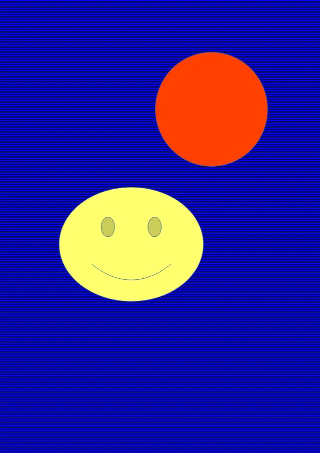

<style>
   .frame {
    border: 2px solid darkgray;
    padding: 5px;
    margin: 10px 0 5px 5px;
    background: #f0f0f0;
    align-items: center;
   }
   .container {
    display: flex;
    flex-direction: row;
    align-items: center;
    justify-content: space-around;
   }
    .frame figcaption {
    margin: 0 auto;
    display: flex;
    flex-direction: row;
    justify-content: center;
   }
</style>

<figure class="frame">
<div class="container">
    <div>
        <figcaption>Original image</figcaption>
    </div>
    <div>
        <figcaption>Resulting image</figcaption>
    </div>
</div>
<div class="container">
    <div>
        
    </div>
    <div>
        
    </div>
</div>
<figcaption>Removing background from ODG vector image</figcaption>
</figure>

Java code example:

```java
import com.aspose.imaging.*;
import com.aspose.imaging.fileformats.png.PngColorType;
import com.aspose.imaging.imageoptions.PngOptions;
import com.aspose.imaging.imageoptions.VectorRasterizationOptions;
import java.io.File;

String[] fileNames = { "golfer.emf", "doretree.emf","Test2.wmf", "test.odg",
                       "test.cdr","test.cmx", "hatch.odg", "Halle_2.svg"};
RemoveBackgroundSettings[] rbs = new RemoveBackgroundSettings[] {
        new RemoveBackgroundSettings()
        {{
            setDetectionLevel(30);
        }},
        new RemoveBackgroundSettings()
        {{
            setBounds(new RectangleF(0, 1000, 5000, 4000));
        }},
        new RemoveBackgroundSettings()
        {{
            setDetectionLevel(10);
        }},
        new RemoveBackgroundSettings(),
        new RemoveBackgroundSettings(),
        new RemoveBackgroundSettings(),
        new RemoveBackgroundSettings()
        {{
            setColor1(Color.getBlue());
        }},
        new RemoveBackgroundSettings()
};

for (int i = 0; i < fileNames.length; i++)
{
    removeBackgroundExample(fileNames[i], rbs[i]);
}

private static void removeBackgroundExample(String fileName, RemoveBackgroundSettings settings)
{
    String baseFolder = "D:\\test\\rb\\";
    String inputFilePath = baseFolder + fileName;
    String outFilePath = baseFolder + "output";
    File outDir = new File(outFilePath);
    if (!outDir.exists())
    {
        outDir.mkdirs();
    }

    try (Image image = Image.load(inputFilePath))
    {
        VectorRasterizationOptions vectorOpt = new VectorRasterizationOptions();
        vectorOpt.setBackgroundColor(Color.getTransparent());
        vectorOpt.setPageSize(Size.to_SizeF(image.getSize()));
        PngOptions options = new PngOptions();
        options.setColorType(PngColorType.TruecolorWithAlpha);
        options.setVectorRasterizationOptions(vectorOpt);

        if (image instanceof VectorImage)
        {
            ((VectorImage)image).removeBackground(settings);
        }

        image.save(outFilePath + "\\" + fileName + ".png", options);
    }
}
```
