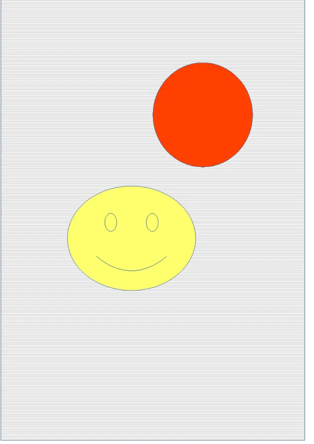

<figure class="frame">

    

        <figcaption>Original image</figcaption>
    

    

        <figcaption>Resulting image</figcaption>
    

    

        
    

    

        
    

<figcaption>Removing background from ODG vector image</figcaption>
</figure>

Java code example:


