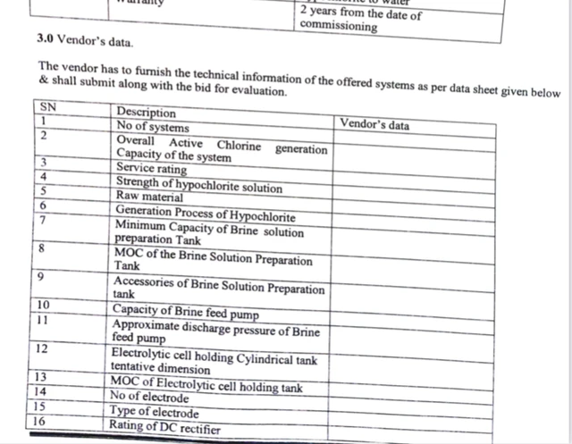

## Alpha blending image filter

<figure class="frame">

Source image

Resulting image

    

        
    

    

        
    

<figcaption>Alpha blending image filter with logo overlay</figcaption>
</figure>

Example C# code: [alpha blending](alpha-blending-image-filter)
