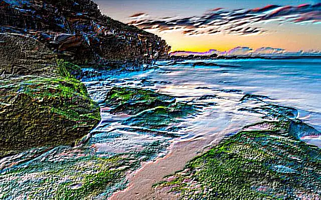

## Kernel Filters


Identical:
```cs
{
    { 0, 0, 0,},
    { 0, 1, 0,},
    { 0, 0, 0,},
};
```

<style>
   .frame {
    border: 2px solid darkgray;
    padding: 5px;
    margin: 10px 0 5px 5px;
    background: #f0f0f0;
    align-items: center;
   }
   .marginauto {
    margin: 10px auto 20px;
    display: block;
   }
   .frame figcaption {
    margin: 0 auto;
    display: flex;
    flex-direction: row;
    justify-content: center;
   }
</style>

<figure class="frame"><p>
    
<figcaption>Original photo template</figcaption>
</p></figure>

Emboss 3x3:
```cs
{
    { -2, -1,  0, },
    { -1,  1,  1, },
    {  0,  1,  2, },
};
```

<figure class="frame"><p>
    
<figcaption>Emboss 3x3 kernel filter</figcaption>
</p></figure>

Sharpen 3x3:
```cs
{
    {  0, -1,  0 },
    { -1,  5, -1 },
    {  0, -1,  0 },
};
```

BlurBox 5x5:
```cs
{
    { 0.04, 0.04, 0.04, 0.04, 0.04,},
    { 0.04, 0.04, 0.04, 0.04, 0.04,},
    { 0.04, 0.04, 0.04, 0.04, 0.04,},
    { 0.04, 0.04, 0.04, 0.04, 0.04,},
    { 0.04, 0.04, 0.04, 0.04, 0.04,},
};
```

<figure class="frame"><p>
    
<figcaption>BlurBox kernel filter</figcaption>
</p></figure>


Custom kernel matrix for MotionBlur 5x5 45%:
```cs
double[,] customKernel = new double[,]
{
  { 0.25, 0,   0,   0,   0    },
  { 0,    0.2, 0,   0,   0    },
  { 0,    0,   0.1, 0,   0    },
  { 0,    0,   0,   0.2, 0    },
  { 0,    0,   0,    0,  0.25 },
};
```

<figure class="frame"><p>
    
<figcaption>Custom Motion blur kernel filter</figcaption>
</p></figure>
