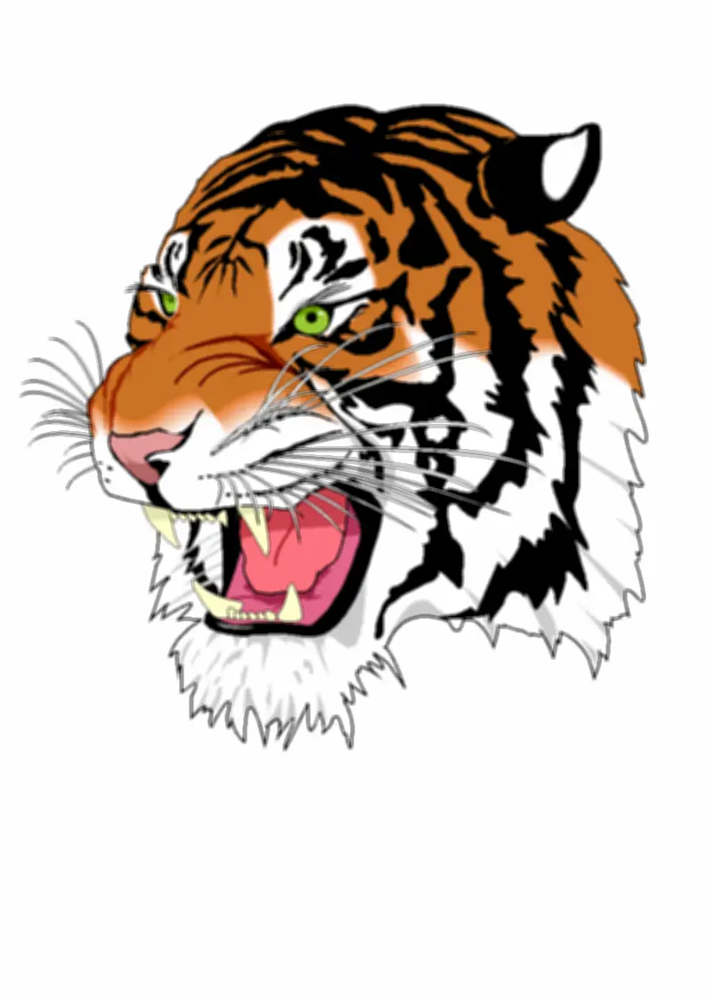

## BlurBox Kernel Filter

<p align='justify'>
&nbsp;&nbsp;&nbsp;&nbsp;&nbsp;&nbsp;&nbsp;&nbsp;
By populating the kernel matrix with equal elements and ensuring a total sum of 1, you can compute the mean value of the surrounding pixel area with a size of 5x5. This process effectively helps eliminate noise and results in a 'Blur Box' image effect.
</p>

```cs
// BlurBox 5x5 kernel
{
    { 0.04, 0.04, 0.04, 0.04, 0.04,},
    { 0.04, 0.04, 0.04, 0.04, 0.04,},
    { 0.04, 0.04, 0.04, 0.04, 0.04,},
    { 0.04, 0.04, 0.04, 0.04, 0.04,},
    { 0.04, 0.04, 0.04, 0.04, 0.04,},
};
```

<style>
   .frame {
    border: 2px solid darkgray;
    padding: 5px;
    margin: 10px 0 5px 5px;
    background: #f0f0f0;
    align-items: center;
   }
   .marginauto {
    margin: 10px auto 20px;
    display: block;
   }
   .frame figcaption {
    margin: 0 auto;
    display: flex;
    flex-direction: row;
    justify-content: center;
   }
   .container {
    display: flex;
    flex-direction: row;
    align-items: center;
    justify-content: space-around;
   }
</style>

<figure class="frame">
<div class="container">
    <div>
        <figcaption>Original image</figcaption>
    </div>
    <div>
        <figcaption>Blur filter</figcaption>
    </div>
</div>
<div class="container">
    <div>
        
    </div>
    <div>
        
    </div>
</div>
<figcaption>BlurBox kernel filter</figcaption>
</figure>

## C# code example

<p align='justify'>
&nbsp;&nbsp;&nbsp;&nbsp;&nbsp;&nbsp;&nbsp;&nbsp;
The following C# code example illustrates the usage of the Aspose.Imaging .NET API. You can employ the `ConvolutionFilter` class, which offers predefined kernel filters such as "Emboss3x3," "GetBlurBox" with customizable size settings, "GetBlurMotion" with adjustable size and angle settings. Additionally, you have the flexibility to create your custom kernel matrix. In this example, image templates in PNG and SVG formats are loaded from the "templates" folder, and filters are applied from a predefined list.
</p>


