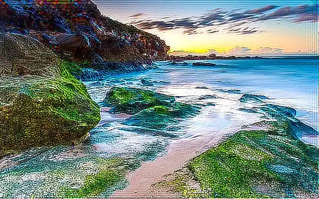

## Deconvolution Kernel Filter

<p align='justify'>
&nbsp;&nbsp;&nbsp;&nbsp;&nbsp;&nbsp;&nbsp;&nbsp;
Deconvolution serves as the inverse matrix operation to a convolution filter. If a convolution transformation is applied, such as with the <a href="../gaussian-blur-filter/">Gaussian blur kernel filter</a>, attempting to reverse this operation cannot fully restore the original image due to the averaging of pixel values and the loss of some details. However, deconvolution is valuable for image restoration and deblurring.
</p>

<p align='justify'>
&nbsp;&nbsp;&nbsp;&nbsp;&nbsp;&nbsp;&nbsp;&nbsp;
In the example below we apply the Gaussian blur convolution filter and then restore the original image with Deconvolution filer:
</p>

```cs
// gaussian 3x3 convolution kernel
{
  {1, 2, 1,},
  {2, 4, 2,},
  {1, 2, 1,},
};
```

```cs
DeconvolutionFilterOptions(ConvolutionFilter.GetGaussian(Size, Sigma))
```
<p align='justify'>
&nbsp;&nbsp;&nbsp;&nbsp;&nbsp;&nbsp;&nbsp;&nbsp;
The restored image is not identical to the original, but it exhibits more details after the deblurring process.
</p>

<style>
   .frame {
    border: 2px solid darkgray;
    padding: 5px;
    margin: 10px 0 5px 5px;
    background: #f0f0f0;
    align-items: center;
   }
   .marginauto {
    margin: 10px auto 20px;
    display: block;
   }
   .frame figcaption {
    margin: 0 auto;
    display: flex;
    flex-direction: row;
    justify-content: center;
   }
   .container {
    display: flex;
    flex-direction: row;
    align-items: center;
    justify-content: space-around;
   }
</style>

<figure class="frame">
<div class="container">
    <div>
        <figcaption>Original image</figcaption>
    </div>
    <div>
        <figcaption>Deconvolution filter</figcaption>
    </div>
</div>
<div class="container">
    <div>
        
    </div>
    <div>
        
    </div>
</div>
<figcaption>Deconvolution kernel filter</figcaption>
</figure>

## C# code example

<p align='justify'>
&nbsp;&nbsp;&nbsp;&nbsp;&nbsp;&nbsp;&nbsp;&nbsp;
The full C# code example below shows the usage of the Aspose.Imaging .NET API. You can utilize the `ConvolutionFilter` class with "GetGaussian" blurring method and subsequently deblur using the <strong>DeconvolutionFilterOptions</strong>. In this example, image templates in PNG and SVG formats are loaded from the "templates" folder, and filters are applied from a predefined list.
</p>


