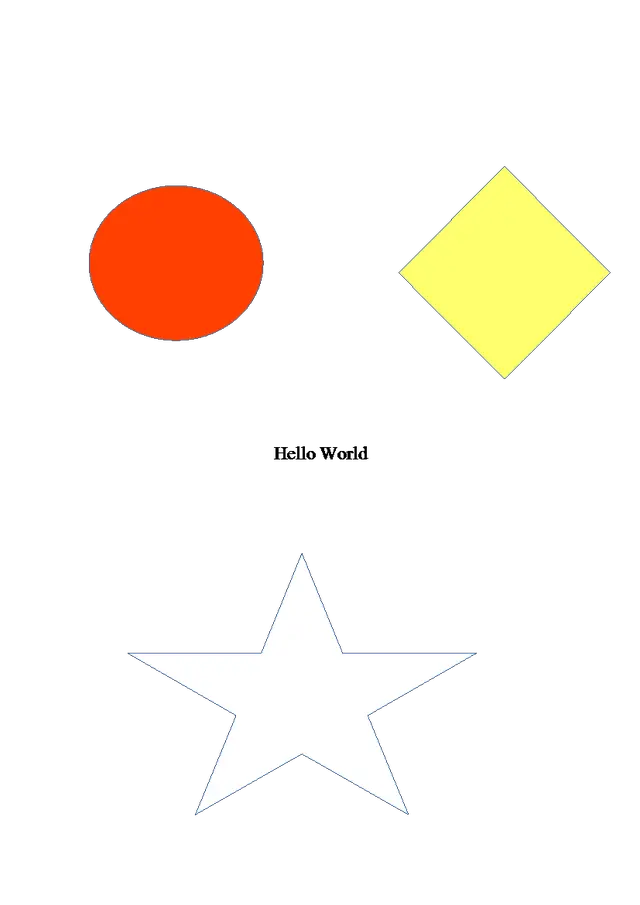

<style>
   .frame {
    border: 2px solid darkgray;
    padding: 5px;
    margin: 10px 0 5px 5px;
    background: #f0f0f0;
    align-items: center;
   }
   .container {
    display: flex;
    flex-direction: row;
    align-items: center;
    justify-content: space-around;
   }
    .frame figcaption {
    margin: 0 auto;
    display: flex;
    flex-direction: row;
    justify-content: center;
   }
</style>

<figure class="frame">
<div class="container">
    <div>
        <figcaption>Original image</figcaption>
    </div>
    <div>
        <figcaption>Resulting image</figcaption>
    </div>
</div>
<div class="container">
    <div>
        
    </div>
    <div>
        
    </div>
</div>
<figcaption>Removing background from vector image</figcaption>
</figure>

C# code example:

```cs
var fileNames = new string[] { "golfer.emf", "doretree.emf","Test2.wmf", "test.odg",
                                "test.cdr","test.cmx", "hatch.odg", "Halle_2.svg"};
var rbs = new RemoveBackgroundSettings[]
{
    new RemoveBackgroundSettings()
    {
        DetectionLevel = 30
    },
    new RemoveBackgroundSettings()
    {
        Bounds = new RectangleF(0, 1000, 5000, 4000)
    },
    new RemoveBackgroundSettings()
    {
        DetectionLevel = 10
    },
    new RemoveBackgroundSettings()
    {

    },
    new RemoveBackgroundSettings()
    {

    },
    new RemoveBackgroundSettings()
    {

    },
    new RemoveBackgroundSettings()
    {
        Color1 = Color.Blue
    },
    new RemoveBackgroundSettings()
    {

    }
};

for (int i = 0; i < fileNames.Length; i++)
{
    RemoveBackgroundExample(fileNames[i], rbs[i]);
}

private void RemoveBackgroundExample(string fileName, RemoveBackgroundSettings settings)
{
    var baseFolder = "D:\\test\\rb\\";
    var inputFilePath = Path.Combine(baseFolder, fileName);
    var outFilePath = Path.Combine(baseFolder, "output");
    if (!Directory.Exists(outFilePath))
    {
        Directory.CreateDirectory(outFilePath);
    }

    using (var image = Image.Load(inputFilePath))
    {
        var options = new PngOptions()
        {
            ColorType = PngColorType.TruecolorWithAlpha,
            VectorRasterizationOptions = new VectorRasterizationOptions()
            {
                BackgroundColor = Color.Transparent,
                PageSize = image.Size
            }
        };

        var vectorImage = image as VectorImage;
        if (vectorImage != null)
        {
            vectorImage.RemoveBackground(settings);
        }

        image.Save(Path.Combine(outFilePath, fileName+".png"), options);
    }
}
```
