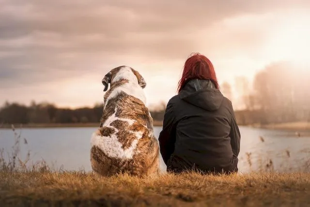
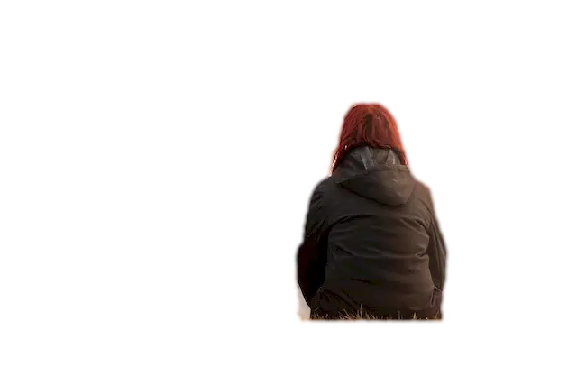
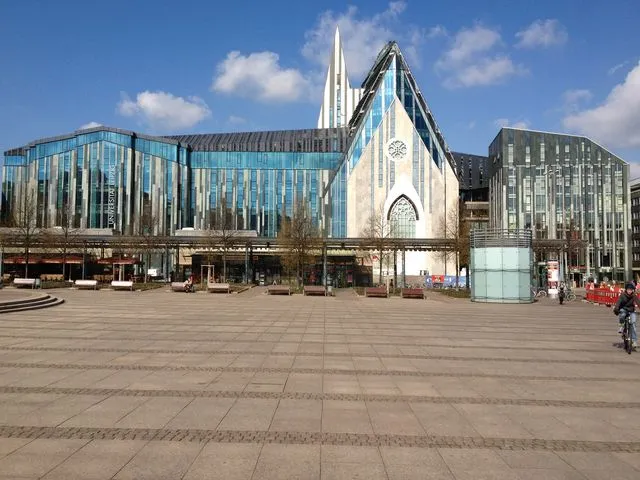
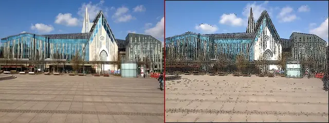
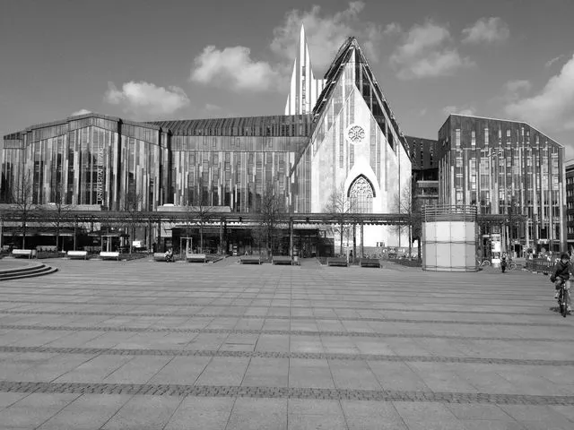
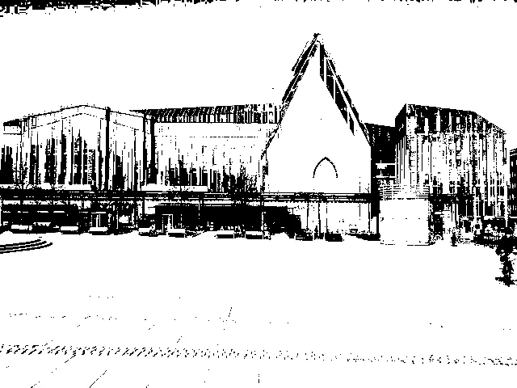
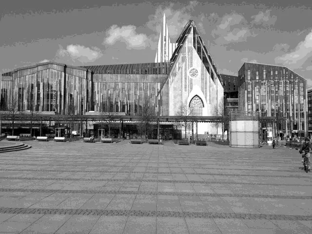

## How to edit your photo or image programmatically

&nbsp;&nbsp;&nbsp;&nbsp;&nbsp;&nbsp;&nbsp;&nbsp;
Selling a unique product without effective advertising can be quite resourceful. This issue becomes even more evident in the realm of the Internet, where capturing a visitor's attention and maintaining their interest poses a real challenge. To illustrate this, let's draw a parallel between the online world and a real city. Imagine us strolling along streets, observing buildings, or driving in a car. Certainly, advertising stands out, whether it's the large banners decorating roads or the sophisticated posters promoting ongoing events. There was a time when such commercial posters became an art form, with famous artists using their skills for illustration. But everyone can afford the ability to produce high-quality images.

&nbsp;&nbsp;&nbsp;&nbsp;&nbsp;&nbsp;&nbsp;&nbsp;
The Aspose.Imaging library for Python .NET proves valuable for bulk image processing and repetitive image editing tasks required while preparing professional advertising materials, event posters, or even student projects. Frequently, the need to adjust source image characteristics like brightness, contrast, or gamma correction in readiness for subsequent publication. The library also facilitates the development of diverse applications or seamless integration into existing ones. For instance, it can be used to convert color images to black and white or grayscale or to provide an image watermarking service.

&nbsp;&nbsp;&nbsp;&nbsp;&nbsp;&nbsp;&nbsp;&nbsp;
This article talks about how to use image editing tools with Aspose.Imaging Python library. If you want to see all the types of images this library can work with, look at the list of <a href="https://docs.aspose.com/imaging/python-net/supported-file-formats/">supported image formats</a>.

### Resizing an image

&nbsp;&nbsp;&nbsp;&nbsp;&nbsp;&nbsp;&nbsp;&nbsp;
Frequently, you have numerous raw images of varying sizes, and the need arises to standardize their widths while maintaining their width-to-length ratio for web placement. With Aspose.Imaging, you can automate the resizing of these images before publishing them. You simply need to specify the desired image width and apply it to the folder containing your raw images, while having the option to convert image formats simultaneously.

Python code examples: [howto resize image](resize-image).

### Crop an image

&nbsp;&nbsp;&nbsp;&nbsp;&nbsp;&nbsp;&nbsp;&nbsp;
Images might include uninteresting sections, or the main  might accidentally be positioned off-center within the photo. In such instances, the need to crop the images and eliminate undesired portions from the edges. Aspose.Imaging offers methods to facilitate image cropping by shifting and removing unwanted areas from the sides.

Python code example: [howto crop image](crop-image).

### Rotate

&nbsp;&nbsp;&nbsp;&nbsp;&nbsp;&nbsp;&nbsp;&nbsp;
In certain situations, you might encounter numerous photos that have been vertically or horizontally flipped, or rotated into incorrect orientations. Rotating each photo manually can be time-consuming but with the assistance of Aspose.Imaging, you can swiftly rotate or flip images collectively.

Python code example: [howto rotate image](rotate-image).

### Remove background

&nbsp;&nbsp;&nbsp;&nbsp;&nbsp;&nbsp;&nbsp;&nbsp;
One of the most frequently requested image operations users often wish to perform is background removal. You might want to remove a human figure or another object from its surroundings. For complex images containing multiple elements, Aspose.Imaging offers various methods involving automatic or manual tagging of objects to facilitate background removal. Through the software library, you can define rectangular areas and preliminary label objects and their categories to enhance the precision of background removal.

Original image:

Image with removed background with assuming object method:

Python code example: [howto remove background](remove-background).

### Filter an image

&nbsp;&nbsp;&nbsp;&nbsp;&nbsp;&nbsp;&nbsp;&nbsp;
You can swiftly improve your photo's appearance by applying a range of filters to enhance sharpness or reduce noise. With the Aspose.Imaging Python library, you have the option to select from a diverse range of filters to apply captivating effects to an image, such as motion effects or blur filters.

Original image:

Image with Gauss blur filter applied:

Python code example: [howto filter image](filter-image).

### Merge images

&nbsp;&nbsp;&nbsp;&nbsp;&nbsp;&nbsp;&nbsp;&nbsp;
To craft collages comprising multiple images, you can leverage the merging function within Aspose.Imaging for Python. This feature allows you to position images adjacently, either horizontally or vertically, on the primary canvas. It's even possible to merge images of varying original formats, and subsequently save the resulting image in the desired new format.

Merged two images into one collage:

Python code example: [howto merge images](merge-images).

### Grayscale image

&nbsp;&nbsp;&nbsp;&nbsp;&nbsp;&nbsp;&nbsp;&nbsp;
One effective way to alter the perception of an image is by converting it to grayscale format. When color isn't a crucial factor, the absence of color can underscore the intrinsic essence of the picture. This force viewers to focus more on image details, as well as the interplay of light and shadow. Thanks to the Aspose Python library, you can effortlessly convert any image type into grayscale format.

Grayscaled image example:

Python code example: [howto grayscale image](grayscale-image).

### Binarize image

&nbsp;&nbsp;&nbsp;&nbsp;&nbsp;&nbsp;&nbsp;&nbsp;
A more profound transformation of images involves converting them into pure black and white, a process known as binarization. In this technique, every pixel is assigned one of two binary values: 1 (black) or 0 (white), with no intermediary grayscale gradation. This yields a striking image that is well-suited for applications such as posters or book illustrations. Aspose.Imaging offers a variety of methods to facilitate the creation of black-and-white images from color originals. These options encompass straightforward threshold techniques as well as more sophisticated methods that consider the values of neighboring pixels.

Example of black and image with binarization threshold 100:

Python code example: [howto binarize image](binarize-image).

### Dither image

&nbsp;&nbsp;&nbsp;&nbsp;&nbsp;&nbsp;&nbsp;&nbsp;
When you convert an image for web publishing using a reduced color palette, you might encounter quality issues with the appearance of large monotone areas with distinct edges. To mitigate this effect, you can utilize the dithering technique offered by the Aspose image editing library, employing either a simple threshold method or a more sophisticated approach involving pixel approximation.

Example of image with `FloydSteinberg` dither method applied:

Python code example: [howto dither image](dither-image).

### Adjust image

&nbsp;&nbsp;&nbsp;&nbsp;&nbsp;&nbsp;&nbsp;&nbsp;
Typically, image editing involves adjusting parameters like brightness, contrast, or color gamma to enhance the initial pictures. Source photos might be excessively dark or light, resulting in lost image details. Adjusting these settings using Aspose.Imaging can enhance the image's impact and give it a more professional appearance.

Python code example: [howto adjust image](adjust-image).

### Drawing images

&nbsp;&nbsp;&nbsp;&nbsp;&nbsp;&nbsp;&nbsp;&nbsp;
With the Aspose image library for Python, you can also draw graphical elements like Lines or Ellipses on a canvas or directly onto other images. Additionally, you can print text on images using chosen fonts and styles. The library offers tools like Pens and Brushes, which come with various colors, widths, and drawing styles for your drawing needs.

Python code example: [howto drawing images](draw-image).

## How to edit your photo or image online

&nbsp;&nbsp;&nbsp;&nbsp;&nbsp;&nbsp;&nbsp;&nbsp;
If you're impressed by the description of Aspose.Imaging's capabilities in this article, you can immediately try out a live demo by clicking on the <a href="https://products.aspose.app/imaging/image-editor">Online image editor</a> link. This will open a web browser window where you can freely upload your image for online editing. Alternatively, you can also upload images for editing from your local disk or cloud services. The editor offers several methods for resizing, cropping, and rotating images, all of which are intuitively configurable to achieve your desired editing outcomes. Once you're satisfied with the changes, you can save and download the resulting image in various widely supported image formats.

&nbsp;&nbsp;&nbsp;&nbsp;&nbsp;&nbsp;&nbsp;&nbsp;
To experiment with the various image filters of Aspose.Imaging, you can use the <a href="https://products.aspose.app/imaging/photo-filter">Online photo editor</a>. This tool allows you to upload your photo and test out editing techniques like adjusting Brightness and Contrast, making Gamma corrections, converting to Grayscale, or applying Binarization. To facilitate your usage, the editor supports up to 20 different image formats, including pdf, jpeg, gif, png, and bmp. If you find the Aspose image editing library for Python valuable, you have the option to download the library from the official repository and request a trial or permanent license.

## Conclusion

&nbsp;&nbsp;&nbsp;&nbsp;&nbsp;&nbsp;&nbsp;&nbsp;
Aspose.Imaging program library helps you to edit images and photos and facilitates the development of graphic manipulating applications and services. The image library provides you ready to use program methods to process images in your own way. Free online photo and images editor with photo filter is available at your convenience where you can try the most popular image editing operations and save the results in many image formats.

