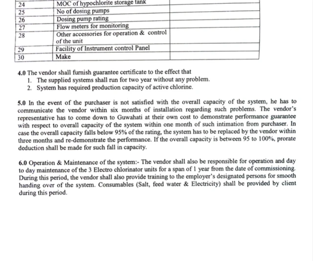

## Alpha blending image filter

&nbsp;&nbsp;&nbsp;&nbsp;&nbsp;&nbsp;&nbsp;&nbsp;
Graphic work involving images can be demanding and time-consuming, especially when tasks contain overlay images. How you can effectively manage color interactions between overlapping images while maintaining varying levels of transparency? The alpha blending image filter offers a seamless solution to these challenges, streamlining your workflow and enhancing image quality. This tool proves beneficial for artists creating a visual masterpiece with photo effects as well as individuals working on scientific illustrations. High-quality images are bound to capture attention and draw more users to your webpage, particularly if you incorporate watermark images with your company logo.

<figure class="frame">

Source image

Resulting image

    

        
    

    

        
    

<figcaption>Alpha blending image filter with logo overlay</figcaption>
</figure>

Example Python code: [alpha blending](alpha-blending-image-filter)
