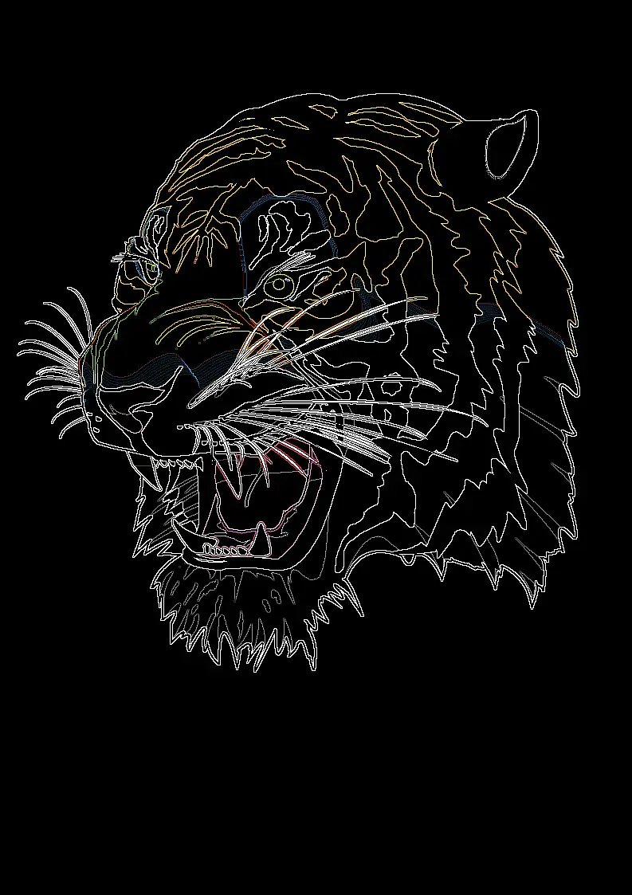

## Kernel Filters


Identical:
```pyhton
[
    [ 0, 0, 0,],
    [ 0, 1, 0,],
    [ 0, 0, 0,],
]
```

<style>
   .frame {
    border: 2px solid darkgray;
    padding: 5px;
    margin: 10px 0 5px 5px;
    background: #f0f0f0;
    align-items: center;
   }
   .marginauto {
    margin: 10px auto 20px;
    display: block;
   }
   .frame figcaption {
    margin: 0 auto;
    display: flex;
    flex-direction: row;
    justify-content: center;
   }
</style>

<figure class="frame"><p>
    
<figcaption>Original vector image</figcaption>
</p></figure>

Edge detection  custom kernel filter:
```python
[
    [ -1, -1, -1,],
    [ -1,  8, -1,],
    [ -1, -1, -1,],
]
```

<figure class="frame"><p>
    
<figcaption>Edge detection kernel filter</figcaption>
</p></figure>

Inverse deconvolution custom kernel filter:

<figure class="frame"><p>
    
<figcaption>Deconvolution custom kernel filter</figcaption>
</p></figure>
