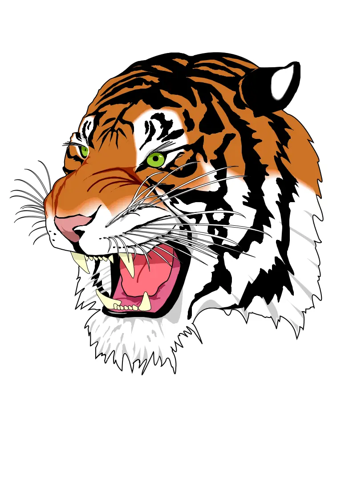

## Blur Box Kernel Filter in Python

<p align='justify'>
&nbsp;&nbsp;&nbsp;&nbsp;&nbsp;&nbsp;&nbsp;&nbsp;
Filling the kernel matrix with uniform elements and maintaining a cumulative sum of 1 allows for the calculation of the average value within the surrounding pixel area, utilizing a 5x5 matrix. The resulting pixel value is determined by summing the 1/25 values or 4% from all adjacent pixels. This specific kernel matrix is identified as a 'Blur Box.' The augmentation of matrix dimensions enhances the blurring effect proportionally.
</p>

```python
# Blur Box 5x5 uniform kernel
[
    [ 0.04, 0.04, 0.04, 0.04, 0.04,],
    [ 0.04, 0.04, 0.04, 0.04, 0.04,],
    [ 0.04, 0.04, 0.04, 0.04, 0.04,],
    [ 0.04, 0.04, 0.04, 0.04, 0.04,],
    [ 0.04, 0.04, 0.04, 0.04, 0.04,],
]
```
<p align='justify'>
&nbsp;&nbsp;&nbsp;&nbsp;&nbsp;&nbsp;&nbsp;&nbsp;
This process initiates a gradual change in pixel values among neighboring elements, effectively introducing a blur to the image. It assists in reducing noise, lowering sharpness, and yielding a soft, indistinct visual outcome.
</p>

<style>
   .frame {
    border: 2px solid darkgray;
    padding: 5px;
    margin: 10px 0 5px 5px;
    background: #f0f0f0;
    align-items: center;
   }
   .marginauto {
    margin: 10px auto 20px;
    display: block;
   }
   .frame figcaption {
    margin: 0 auto;
    display: flex;
    flex-direction: row;
    justify-content: center;
   }
   .container {
    display: flex;
    flex-direction: row;
    align-items: center;
    justify-content: space-around;
   }
</style>

<figure class="frame">
<div class="container">
    <div>
        <figcaption>Original image</figcaption>
    </div>
    <div>
        <figcaption>Blur filter</figcaption>
    </div>
</div>
<div class="container">
    <div>
        
    </div>
    <div>
        
    </div>
</div>
<figcaption>Blur Box kernel filter</figcaption>
</figure>

## Python code example

<p align='justify'>
&nbsp;&nbsp;&nbsp;&nbsp;&nbsp;&nbsp;&nbsp;&nbsp;
The provided Python code example demonstrates the utilization of the Aspose.Imaging Python API. Utilize the `ConvolutionFilter` class, which provides pre-defined kernel filters, including <strong>GetBlurBox()</strong> with adjustable size settings. Furthermore, you retain the flexibility to craft your personalized kernel matrix. In this example, image templates in PNG and SVG formats are loaded from the "templates" folder, and a set of filters are applied from a predefined list.
</p>


