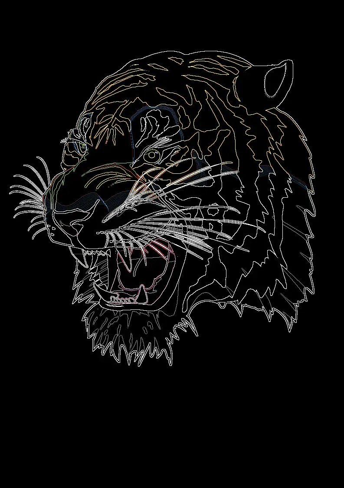

## Edge Detection Custom Kernel Filter

<p align='justify'>
&nbsp;&nbsp;&nbsp;&nbsp;&nbsp;&nbsp;&nbsp;&nbsp;
The custom kernel filter for edge detection shares similarities with the <a href="../sharpen-filter/">Sharpen filter</a> but with a notable distinction: the total sum of matrix elements equals zero. Consequently, the resulting image appears almost black, except for pixels that deviate from their neighbors. These pixels typically reside at the boundaries between distinct areas or edges.
</p>

<p align='justify'>
&nbsp;&nbsp;&nbsp;&nbsp;&nbsp;&nbsp;&nbsp;&nbsp;
In this example, the central pixel value is compared to its surrounding pixels. It is possible to define a custom kernel to specifically identify edges in either horizontal or vertical directions.
</p>

Edge detection  custom kernel filter:
```python
# edge detection kernel
[
    [ -1, -1, -1,],
    [ -1,  8, -1,],
    [ -1, -1, -1,],
]
```

<p align='justify'>
&nbsp;&nbsp;&nbsp;&nbsp;&nbsp;&nbsp;&nbsp;&nbsp;
Ultimately, applying the filter results in retaining only the contours of the image against a black background.
</p>

<style>
   .frame {
    border: 2px solid darkgray;
    padding: 5px;
    margin: 10px 0 5px 5px;
    background: #f0f0f0;
    align-items: center;
   }
   .marginauto {
    margin: 10px auto 20px;
    display: block;
   }
   .frame figcaption {
    margin: 0 auto;
    display: flex;
    flex-direction: row;
    justify-content: center;
   }
   .container {
    display: flex;
    flex-direction: row;
    align-items: center;
    justify-content: space-around;
   }
</style>

<figure class="frame">
<div class="container">
    <div>
        <figcaption>Original image</figcaption>
    </div>
    <div>
        <figcaption>Edge detection</figcaption>
    </div>
</div>
<div class="container">
    <div>
        
    </div>
    <div>
        
    </div>
</div>
<figcaption>Edge detection kernel filter</figcaption>
</figure>

## Python code example

<p align='justify'>
&nbsp;&nbsp;&nbsp;&nbsp;&nbsp;&nbsp;&nbsp;&nbsp;
The following Python code example illustrates the usage of the Aspose.Imaging .NET API. You can employ the `ConvolutionFilter` class, which offers predefined kernel filters, as well as <strong>custom kernel</strong> matrix. In this example, image templates in PNG and SVG formats are loaded from the "templates" folder, and filters are applied from a predefined list.
</p>


