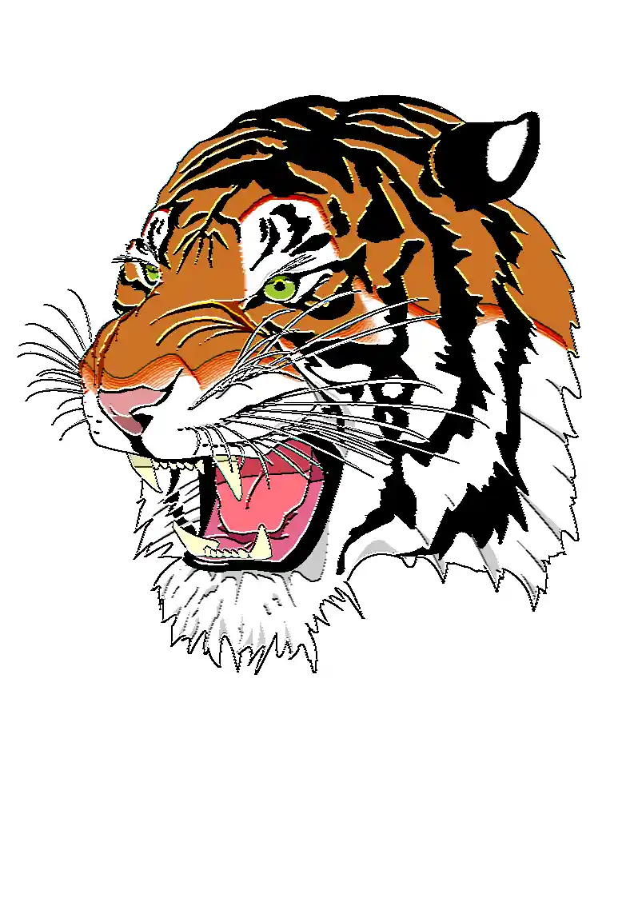

## Emboss Kernel Filter in Python

<p align='justify'>
&nbsp;&nbsp;&nbsp;&nbsp;&nbsp;&nbsp;&nbsp;&nbsp;
In this particular case, we manipulate the values of pixels based on their proximity to neighboring pixels. The outcome involves a proportional increase in pixel values about the upper surrounding pixels and a decrease corresponding to the bottom surroundings. In essence, pixels at the top with a brighter presence lead to a more pronounced increase, while those at the bottom, with a higher brightness, result in a decrease. The numerical scale has a range from 0 to 255, where 255 represents pure white and 0 corresponds to black color. Should the outcome exceed 255, it sets to the cap at 255, and values dipping below 0 meet the threshold of 0. The cumulative sum of all matrix coefficients maintains equality to 1, ensuring a constant image brightness.
</p>

```python
# emboss3x3 horizontal custom kernel
[
    [  2,  3,  2, ],
    [  0,  1,  0, ],
    [ -2, -3, -2, ],
]
```

<p align='justify'>
&nbsp;&nbsp;&nbsp;&nbsp;&nbsp;&nbsp;&nbsp;&nbsp;
Consequently, the edges and contours of the image undergo a visual enhancement, gaining additional shadowing from the bottom side and heightened illumination from the upper side. This particular image effect, recognized as the "Emboss" filter, imparts an appearance alike to the image being raised from the background. The outcome yields a captivating visual illusion with a sense of depth and texture.
</p>

<style>
   .frame {
    border: 2px solid darkgray;
    padding: 5px;
    margin: 10px 0 5px 5px;
    background: #f0f0f0;
    align-items: center;
   }
   .marginauto {
    margin: 10px auto 20px;
    display: block;
   }
   .frame figcaption {
    margin: 0 auto;
    display: flex;
    flex-direction: row;
    justify-content: center;
   }
   .container {
    display: flex;
    flex-direction: row;
    align-items: center;
    justify-content: space-around;
   }
</style>

<figure class="frame">
<div class="container">
    <div>
        <figcaption>Original image</figcaption>
    </div>
    <div>
        <figcaption>Emboss filter</figcaption>
    </div>
</div>
<div class="container">
    <div>
        
    </div>
    <div>
        
    </div>
</div>
<figcaption>Emboss 3x3 kernel filter</figcaption>
</figure>


## Python code example

<p align='justify'>
&nbsp;&nbsp;&nbsp;&nbsp;&nbsp;&nbsp;&nbsp;&nbsp;
The presented Python code exemplifies the utilization of the Aspose.Imaging Python API. Use the `ConvolutionFilter` class, which provides pre-defined kernel filters like <strong>get_emboss_3x3()</strong> and <strong>get_emboss_5x5()</strong> methods with different matrix sizes. Moreover, you retain the flexibility to craft your custom kernel matrix. Within this code snippet, image templates in raster PNG and as well as vector SVG formats are loaded from the "templates" folder, and a set of filters are applied from a predefined list.
</p>


