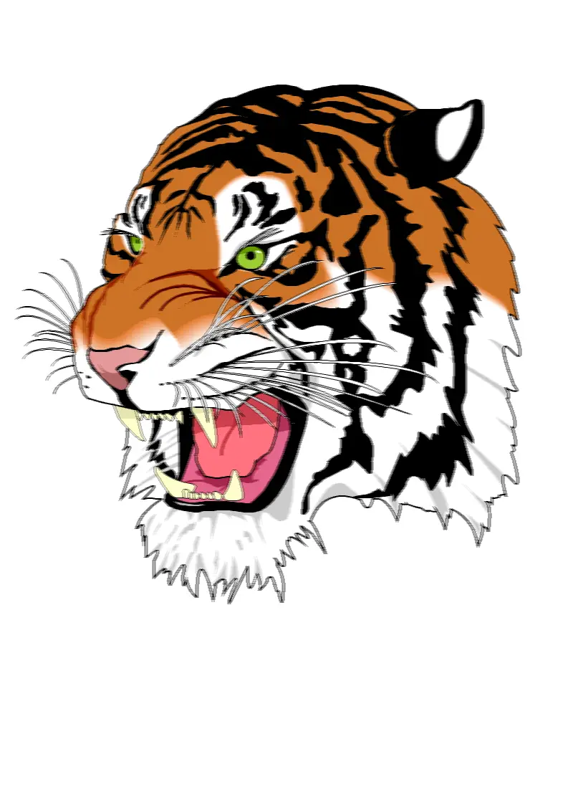

## Motion Blur Custom Kernel Filter in Python

<p align='justify'>
&nbsp;&nbsp;&nbsp;&nbsp;&nbsp;&nbsp;&nbsp;&nbsp;
You can create a custom kernel by placing elements in a specific way, like along a horizontal line. In this setup, the central pixel value is figured out by looking at the average of these pixels, creating the 'Motion Blur' effect. When certain elements have higher importance, they impact the final pixel value more in the Motion Blur effect. Making sure the total of all these elements adds up to 1 helps keep the original brightness of the picture. The freedom to arrange elements in different directions lets you make various motion effects in the image.
</p>

```python
# custom MotionBlur horizontal 7x7 kernel
[
  [ 0,    0,    0,    0,    0,   0,    0    ],
  [ 0,    0,    0,    0,    0,   0,    0    ],
  [ 0,    0,    0,    0,    0,   0,    0    ],
  [ 0.15, 0.15, 0.15, 0.1,  0.15, 0.15, 0.15],
  [ 0,    0,    0,    0,    0,   0,    0    ],
  [ 0,    0,    0,    0,    0,   0,    0    ],
  [ 0,    0,    0,    0,    0,   0,    0    ],
]
```
<p align='justify'>
&nbsp;&nbsp;&nbsp;&nbsp;&nbsp;&nbsp;&nbsp;&nbsp;
This effect imitates the case of a camera moving horizontally while capturing a photo, generating the illusion of motion in the image.
</p>

<style>
   .frame {
    border: 2px solid darkgray;
    padding: 5px;
    margin: 10px 0 5px 5px;
    background: #f0f0f0;
    align-items: center;
   }
   .marginauto {
    margin: 10px auto 20px;
    display: block;
   }
   .frame figcaption {
    margin: 0 auto;
    display: flex;
    flex-direction: row;
    justify-content: center;
   }
   .container {
    display: flex;
    flex-direction: row;
    align-items: center;
    justify-content: space-around;
   }
</style>

<figure class="frame">
<div class="container">
    <div>
        <figcaption>Original image</figcaption>
    </div>
    <div>
        <figcaption>MotionBlur filter</figcaption>
    </div>
</div>
<div class="container">
    <div>
        
    </div>
    <div>
        
    </div>
</div>
<figcaption>Custom MotionBlur kernel filter</figcaption>
</figure>


## Python code example

<p align='justify'>
&nbsp;&nbsp;&nbsp;&nbsp;&nbsp;&nbsp;&nbsp;&nbsp;
The provided Python code example demonstrates how to utilize the Aspose.Imaging Python API. You can use the `ConvolutionFilter` class, which provides pre-defined kernel filters like <strong>GetBlurMotion()</strong> with customizable size and angle parameters. Moreover, you retain the freedom to design your custom kernel matrix. In this instance, templates in PNG and SVG formats are loaded from the "templates" directory, and a set of filters is implemented from a predefined list.
</p>


