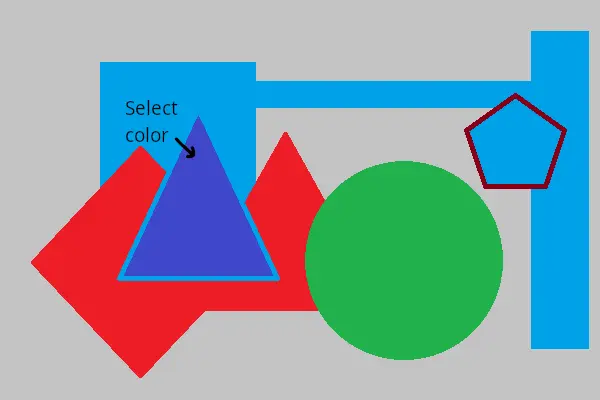
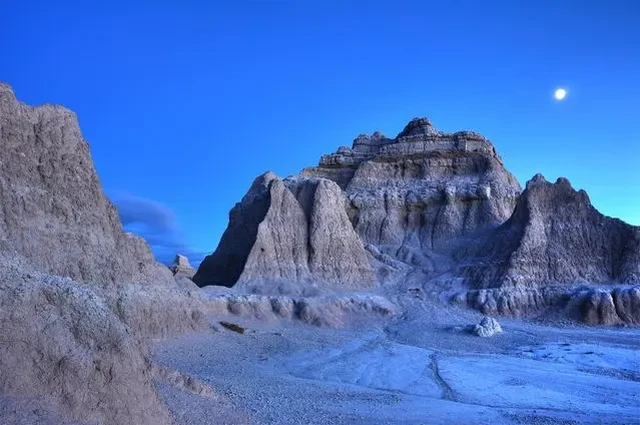
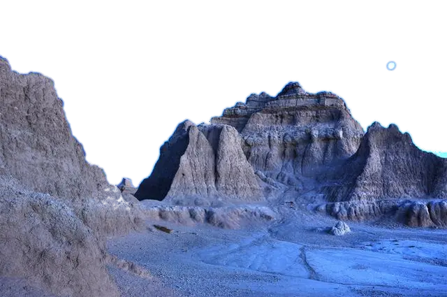
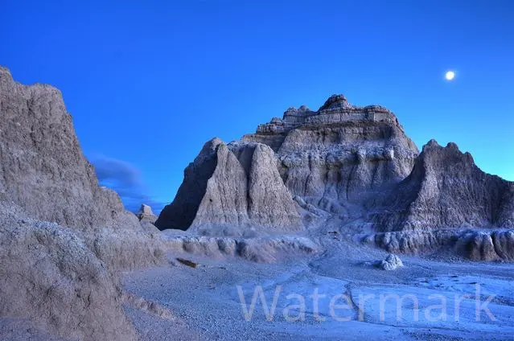
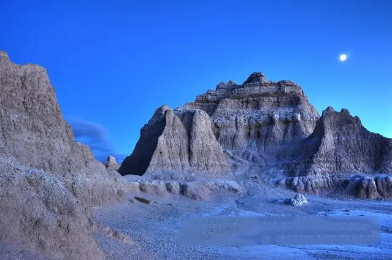

## Alpha blending image filter

&nbsp;&nbsp;&nbsp;&nbsp;&nbsp;&nbsp;&nbsp;&nbsp;
Increasing awareness and, consequently, web page traffic is the goal of any website owner. One effective method to attract users is by utilizing the alpha blending image filter to apply watermarks using an overlay image. Distributing images with your brand name across the internet not only increases your recognition but also safeguards the image's quality. This blend image filter serves as both advertisement and protection against image theft.

<figure class="frame">

Source image

Resulting image

    

        
    

    

        
    

<figcaption>Alpha blending image filter with logo overlay</figcaption>
</figure>

Example Java code: [alpha blending](alpha-blending-image-filter)

&nbsp;&nbsp;&nbsp;&nbsp;&nbsp;&nbsp;&nbsp;&nbsp;
However, this isn't the only reason to include the alpha blending image effect in your arsenal of image manipulation tools. Using this image filter presents an excellent opportunity to introduce creativity into your work. For instance, you can achieve transparency effects by layering images with different opacity levels, transforming an ordinary portrait into a unique collage-like creation, and much more.

## Magic Wand tool

&nbsp;&nbsp;&nbsp;&nbsp;&nbsp;&nbsp;&nbsp;&nbsp;
The process of image editing resembles the work of an artist, but instead of a physical canvas and brushes, a designer's toolkit includes various functions, one of which is the Magic Wand tool. It proves invaluable when dealing with areas of similar color tints. With the Magic Wand tool, you can effortlessly highlight the tone you wish to adjust, and the tool will automatically select the desired areas.

<figure class="frame">

Source image

Resulting image

    

        
    

    

        
    

<figcaption>Magic Wand tool: blue shape color selection</figcaption>
</figure>

&nbsp;&nbsp;&nbsp;&nbsp;&nbsp;&nbsp;&nbsp;&nbsp;
When editing a landscape where a vast portion of the canvas is filled with blue sky, the task may involve replacing specific tones with others. Magic Wand tool offers an option to fine-tune the degree of color tolerance. Besides its color-related capabilities, the tool excels in selecting complex masks. Smoothing the edges ensures that the final image with the object appears more natural.

<figure class="frame">

Source image

Resulting image

    

        
    

    

        
    

<figcaption>Magic Wand tool: blue sky color selection</figcaption>
</figure>

Example Java code: [magic wand](magic-wand-filter/)

## Remove watermark image filter

&nbsp;&nbsp;&nbsp;&nbsp;&nbsp;&nbsp;&nbsp;&nbsp;
Adding watermarks to photos is a common practice in image processing. However, there are instances where the opposite, and more intricate, task becomes necessary - removing watermarks. Your images might be disfigured by the inclusion of technical data that needs to be eliminated before publication. In such cases, employing a watermark removal image filter is a highly effective solution.

&nbsp;&nbsp;&nbsp;&nbsp;&nbsp;&nbsp;&nbsp;&nbsp;
Remove watermark filter is designed to automatically remove watermarks, but for optimal usage, you must initially define the coordinates of the watermark's location. The filter offers a range of removal mode settings. You can select the algorithm to be employed for filling the watermark area and specify the maximum number of attempts. It's worth noting that increasing the number of attempts enhances the final result but demands more computational resources.

<figure class="frame">

Source image

Resulting image

    

        
    

    

        
    

<figcaption>Watermark removal image filter example</figcaption>
</figure>

Example Java code: [remove watermark](remove-watermark-filter/)
