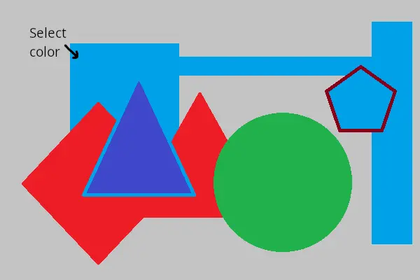

## Alpha blending image filter

&nbsp;&nbsp;&nbsp;&nbsp;&nbsp;&nbsp;&nbsp;&nbsp;
Despite the vast possibilities offered by modern computer graphics, it's becoming progressively challenging to captivate users in the online realm. However, images that exhibit not only mastery but also ingenuity have the potential to generate maximum traffic to a webpage. For instance, achieving a misty photo effect in a landscape doesn't necessitate acquiring paints; employing alpha blending image filter is sufficient.

&nbsp;&nbsp;&nbsp;&nbsp;&nbsp;&nbsp;&nbsp;&nbsp;
Beyond artistic applications, alpha blending image filter serves a crucial role in watermarking images. Through alpha blending, you can not only establish the author's ownership but also promote the identity of an individual or a company. In the image example below, we've positioned a semi-transparent Aspose logo onto the original document.

<figure class="frame">

Source image

Resulting image

    

        
    

    

        
    

<figcaption>Alpha blending image filter with logo overlay image</figcaption>
</figure>

Example C# code: [alpha blending](alpha-blending-image-filter)

## Magic Wand tool

&nbsp;&nbsp;&nbsp;&nbsp;&nbsp;&nbsp;&nbsp;&nbsp;
Working with images and photos often involves operations such as selecting a specific color area to adjust or replace with another. Without a tool like the Magic Wand, graphic designers would face extreme difficulty in selecting areas with complex outlines or multiple areas sharing a similar color. With the Magic Wand, you can simply choice on a point within a single-color area, and the tool will automatically select the entire area around it that shares a similar color. 

<figure class="frame">

Source image

Resulting image

    

        
    

    

        
    

<figcaption>Magic Wand tool: light-blue color selection</figcaption>
</figure>

&nbsp;&nbsp;&nbsp;&nbsp;&nbsp;&nbsp;&nbsp;&nbsp;
You can adjust the degree of color similarity by setting a threshold for color comparison. The areas selected using this method can be combined, subtracted from one another, or have the selection inverted. Feathering can also be applied to the edges of the areas to achieve a smooth transition. In the example shown in the image below, we selected the green background area around the shape, added yellow specks to the selection, and then removed the resulting mask from the original image. As a result, we will obtain a figure without a background, which can then be used for creating other graphic works.

<figure class="frame">

Source image

Resulting image

    

        
    

    

        
    

<figcaption>Magic Wand tool: green background color selection</figcaption>
</figure>

Example C# code: [magic wand](magic-wand-filter/)

## Remove watermark image filter

&nbsp;&nbsp;&nbsp;&nbsp;&nbsp;&nbsp;&nbsp;&nbsp;
Certain smartphones and cameras can add watermarks to photos as they capture them. These watermarks can include manufacturer logos or device model names. If you need to share these photos without these unwanted marks, you can use the Watermark Removal image filter.

&nbsp;&nbsp;&nbsp;&nbsp;&nbsp;&nbsp;&nbsp;&nbsp;
To effectively remove these watermarks, you need to define the area where the mark is located by indicating its coordinates. Utilizing the available image data, the algorithm will automatically replace the watermark area with similar fragments. In the image filter options, you can choose between the `Content-Aware Fill` or the `Telea` watermark removal algorithm. Furthermore, you can specify the number of attempts to remove the watermark. In this scenario, the algorithm will determine the best result.

<figure class="frame">

Source image

Resulting image

    

        
    

    

        
    

<figcaption>Watermark removal filter example</figcaption>
</figure>

Example C# code: [remove watermark](remove-watermark-filter/)
