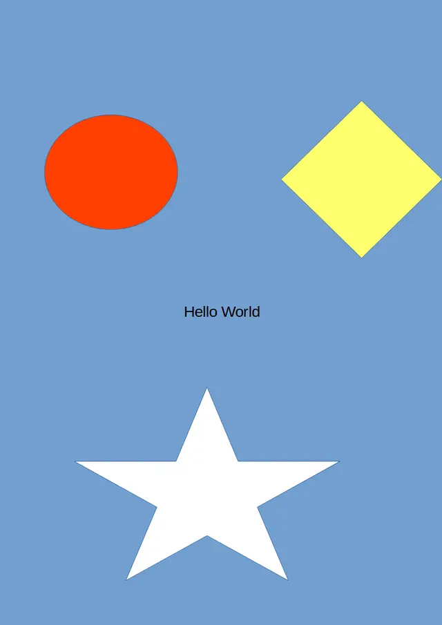
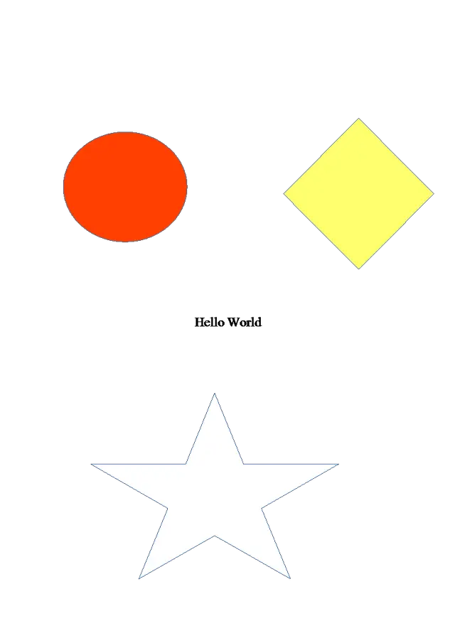

## Using Aspose.Imaging for .NET to Remove Background from Vector Images

&nbsp;&nbsp;&nbsp;&nbsp;&nbsp;&nbsp;&nbsp;&nbsp;
Background removal is a widely applied task that goes beyond the realm of raster images; it extends its reach to vector images. Aspose.Imaging for .NET provides a powerful solution for background removal on vector images like SVG, EMF or CDR formats. You can either preserve the results in the original image format or convert them into various other raster formats.

&nbsp;&nbsp;&nbsp;&nbsp;&nbsp;&nbsp;&nbsp;&nbsp;
The approach to processing vector images deflects from that of raster formats. In vector files, the background might consist of numerous colored shapes covering the whole image, creating an overlap with foreground elements. Aspose.Imaging graphic library for .NET distinguishes objects without underlying shapes as part of the background. Additionally, you have the flexibility to assign a specific background color for removal, excluding foreground objects of the same color from the elimination process. Moreover, you can indicate an area within the image for targeted background removal. The removed background can then be replaced with another color or saved as foreground shapes on a transparent layer.

### Example of a Vector Image Background Removal

&nbsp;&nbsp;&nbsp;&nbsp;&nbsp;&nbsp;&nbsp;&nbsp;
Below is an illustration of a vector image. The original image contains a blue-colored shape on the background overlapped by various foreground objects. After background removal, the resulting image showcases the foreground shapes against a transparent backdrop:

<figure class="frame">

    

        <figcaption>Original image</figcaption>
    

    

        <figcaption>Resulting image</figcaption>
    

    

        
    

    

        
    

<figcaption>Removing background from vector image</figcaption>
</figure>

### C# code example

&nbsp;&nbsp;&nbsp;&nbsp;&nbsp;&nbsp;&nbsp;&nbsp;
Here is a C# code example that shows the process of background removal in image processing. To automate this procedure for vector images, you need to compile a list of the desired source file names and provide specific settings. Following this, the <a href="https://reference.aspose.com/imaging/ru/net/aspose.imaging/vectorimage/removebackground/">RemoveBackground() method</a> of the `VectorImage` class is employed to eliminate the background from the vector images. The final step involves rasterizing the images into the PNG format, complete with a transparent background:



&nbsp;&nbsp;&nbsp;&nbsp;&nbsp;&nbsp;&nbsp;&nbsp;
This C# code showcases how you can automate the background removal process for a list of vector images, saving the results as PNG files with transparent backgrounds. Adjust the file names and settings in the list according to your specific requirements.

