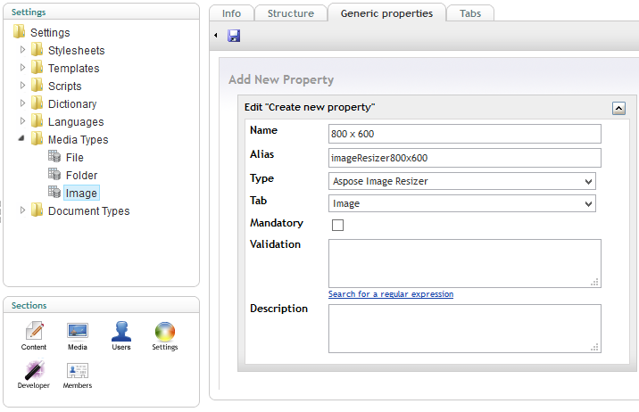

## **Introduction**
Aspose Image resizer is an Umbraco datatype which allow automatic image resizing on save. It uses powerful image processing features provided by Aspose.Imaging. Aspose.Imaging for .NET is an imaging library that lets developers create, edit, draw or convert images in their .NET applications.
### **Module Features**
This initial version of the datatype have the following features

- Use multiple copies on one document
- Use on Media as well as Content and Members
- Does not overwrite original image
- Saves resized images in the original image media folder
- Stores url to image as plain text for easy access via xslt
## **System Requirements and Supported Platforms**
### **System Requirements**
In order to setup this module you need to have the following requirements met:

- Umbraco 4.5 +

Please feel free to contact us if you wish to install this module on other versions of Umbraco.
### **Supported Platforms**
The module is supported on all versions of

- Umbraco running on ASP.NET 2.0
## **Downloading**
You can download Aspose Image Resizer from one of the following locations

- [CodePlex ](https://archive.codeplex.com/?p=asposeumbraco)
- [Github ](https://github.com/aspose-imaging/Aspose.Imaging-for-.NET/releases)
## **Installing**
After you have installed the Aspose Image Resizer it is really simple to start using it. Please follow these simple steps to get started:

**Add new DataType**

1. Make sure you are logged-in to Umbraco **Developer** section, for example <http://www.myblog.com/umbraco/>
1. Click **Developer** in the list of sections in bottom left of the screen.
1. Right click on **Data Types** node and click **Create.**
1. Add **Aspose Image Resizer** in name field and click **Create** button.
1. On the next screen make sure that Aspose Image Resizer is selected in **Render control** field.
1. Add required width and height in corresponding fields below for example 800 and 600
1. Click save

{}

**Add new property in Image Media Type**

1. Click **Settings** in the list of sections in bottom left of the screen.
1. Expand **Media Types** node and click on **Image**
1. Switch to **Generic Properties** tab
1. Click on **Click here to add a new property** link
1. Fill Name and Alias field e.g. *800 x 600* and *imageResizer800x600*
1. Make sure *Aspose Image Resizer* is selected in **Type** field and Image in **Tab** field.
1. Click Save.

## **Using**
After you have installed and configured the Aspose Image Resizer it is really simple to start using it. To test try uploading a new image to Media

1. Make sure you are logged-in to Umbraco **Developer** section, for example <http://www.myblog.com/umbraco/>
1. Click **Media** in the list of sections in bottom left of the screen.
1. Right click on **Media** node and click **Create**
1. Add name of the image e.g. asposeHomePage and Select **Image** in Select Media type dropdown.
1. Click **Create**
1. Select an image using Browse button in front of Upload image
1. Click Save and you will see the resized image at the bottom under 800 x 600 heading.

Now you can use this resized image in your content by inserting the image using Rich Text Editor. In order to use the resized version you just need to go to HTML view and then append the name of the image with size e.g. from myImage.jpg to myImage_800x600.jpg as shown below



 


## **Video Demo**
Please check [the video](https://www.youtube.com/watch?v=LJTXPbf9xLI) below to see the module in action.
## **Support, Extend and Contribute**
### **Support**
From the very first days of Aspose, we knew that just giving our customers good products would not be enough. We also needed to deliver good service. We are developers ourselves and understand how frustrating it is when a technical issue or a quirk in the software stops you from doing what you need to do. We're here to solve problems, not create them.

This is why we offer free support. Anyone who uses our product, whether they have bought them or are using an evaluation, deserves our full attention and respect.

You can log any issues or suggestions related to Aspose Image Resizer Modules using any of the following platforms

- [CodePlex ](https://archive.codeplex.com/?p=asposeumbraco)
- [Github ](https://github.com/aspose-imaging/Aspose.Imaging-for-.NET/issues)
### **Extend and Contribute**
Aspose Image Resizer datatype is open source and its source code is available on the major social coding websites listed below. Developers are encouraged to download the source code and extend the functionality as per their own requirements.
#### **Source Code**
You can get the latest source code from one of the following locations

- [CodePlex ](https://archive.codeplex.com/?p=asposeumbraco)
#### **How to configure the source code**
You need to have the following installed in order to open and extend the source code

- Visual Studio 2010 or higher

Please follow these simple steps to get started

1. Download/Clone the source code.
1. Open Visual Studio 2010 and Choose **File** > **Open Project**
1. Browse to the latest source code that you have downloaded and open **Aspose.UmbracoImageResizer.sln**
