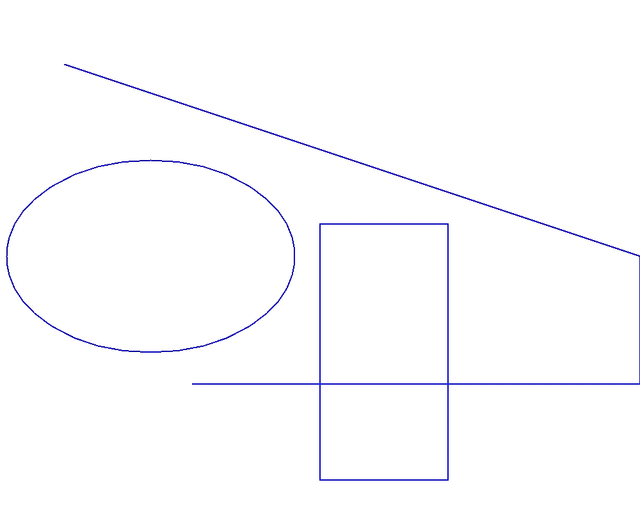

## How to draw an image

&nbsp;&nbsp;&nbsp;&nbsp;&nbsp;&nbsp;&nbsp;&nbsp;
Several methods are available for drawing graphics primitives such as
<a href="https://reference.aspose.com/imaging/ru/python-net/aspose.imaging/graphics/#draw_line_pen_x1_y1_x2_y2_104">draw_line</a>,
<a href="https://reference.aspose.com/imaging/ru/python-net/aspose.imaging/graphics/#draw_ellipse_pen_rect_40">draw_ellipse</a>,
<a href="https://reference.aspose.com/imaging/ru/python-net/aspose.imaging/graphics/#draw_rect_pen_x_y_width_height_124">draw_rect</a>
<a href="https://reference.aspose.com/imaging/ru/python-net/aspose.imaging/graphics/#draw_arc_pen_x_y_width_height_start_angle_sweep_angle_5">draw_arc</a>,
<a href="https://reference.aspose.com/imaging/ru/python-net/aspose.imaging/graphics/#draw_bezier_pen_pt1_pt2_pt3_pt4_11">draw_bezier</a> and
<a href="https://reference.aspose.com/imaging/ru/python-net/aspose.imaging/graphics/#draw_string_s_font_brush_layout_rectangle_132">draw_string</a>.
In the beginning, we create a graphic surface to draw an image and describe graphic properties. In our example, we will create a surface with a size of 100 x 100 pixels and a color depth of 32 bits per pixel and set the background to yellow color with <a href="https://reference.aspose.com/imaging/ru/python-net/aspose.imaging/graphics/#clear_color_1">Clear method</a>. Next, we define a drawing tool - a Pen object with a Blue color, to draw a dotted line or use SolidBrush for continuous lines with different colors, followed by X and Y coordinates of the start and end points of the lines:



&nbsp;&nbsp;&nbsp;&nbsp;&nbsp;&nbsp;&nbsp;&nbsp;
A more detailed description of how to draw graphic elements such as lines, ellipses, Bezier curves and text strings, you can find in the Aspose Imaging <a href="https://docs.aspose.com/imaging/ru/python-net/drawing-images/">Developer Guide</a>.

Example of the image with lines, ellipses and rectangles drawings on a transparent background:

