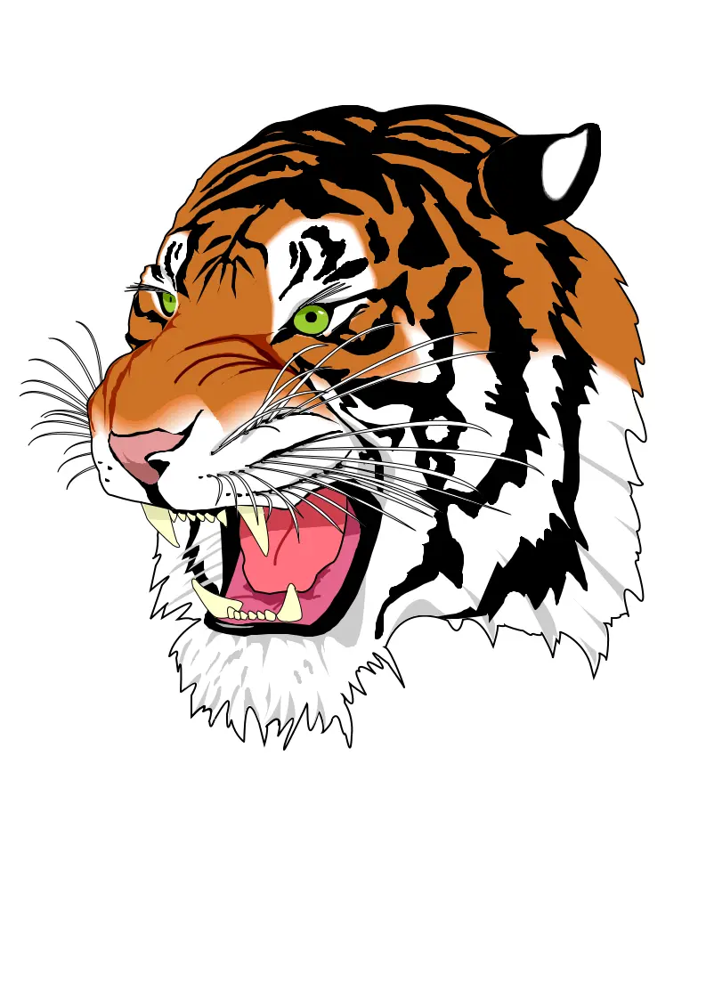

## Deconvolution Kernel Filter in Python

<p align='justify'>
&nbsp;&nbsp;&nbsp;&nbsp;&nbsp;&nbsp;&nbsp;&nbsp;
A deconvolution filter acts as the inverse matrix operation to a convolution operation. When applying a convolution transformation, such as using a <a href="../gaussian-blur-filter/">Gaussian blur kernel filter</a>, attempting to reverse this operation cannot fully restore the original image. This limitation arises from the averaging of pixel values during convolution, resulting in the loss of certain details. However, deconvolution is crucial in image restoration and deblurring processes.
</p>

<p align='justify'>
&nbsp;&nbsp;&nbsp;&nbsp;&nbsp;&nbsp;&nbsp;&nbsp;
In the presented example, we initially apply a Gaussian blur convolution filter and then proceed to restore the original image using a Deconvolution filter:
</p>

```python
## gaussian blur 3x3 convolution kernel
[
  [1, 2, 1,],
  [2, 4, 2,],
  [1, 2, 1,],
]
```

```python
DeconvolutionFilterOptions(ConvolutionFilter.get_gaussian(size, sigma))
```
<p align='justify'>
&nbsp;&nbsp;&nbsp;&nbsp;&nbsp;&nbsp;&nbsp;&nbsp;
The processed image may not be identical to the original, it does reveal more details following the deblurring process.
</p>

<style>
   .frame {
    border: 2px solid darkgray;
    padding: 5px;
    margin: 10px 0 5px 5px;
    background: #f0f0f0;
    align-items: center;
   }
   .marginauto {
    margin: 10px auto 20px;
    display: block;
   }
   .frame figcaption {
    margin: 0 auto;
    display: flex;
    flex-direction: row;
    justify-content: center;
   }
   .container {
    display: flex;
    flex-direction: row;
    align-items: center;
    justify-content: space-around;
   }
</style>

<figure class="frame">
<div class="container">
    <div>
        <figcaption>Original image</figcaption>
    </div>
    <div>
        <figcaption>Deconvolution filter</figcaption>
    </div>
</div>
<div class="container">
    <div>
        
    </div>
    <div>
        
    </div>
</div>
<figcaption>Deconvolution kernel filter</figcaption>
</figure>

## Python code example

<p align='justify'>
&nbsp;&nbsp;&nbsp;&nbsp;&nbsp;&nbsp;&nbsp;&nbsp;
The comprehensive Python code example below demonstrates the application of the Aspose.Imaging Python API. Utilize the `ConvolutionFilter` class with the <strong>get_gaussian()</strong> blurring method and then proceed to deblur using the <strong>DeconvolutionFilterOptions</strong>. In this illustration, image templates in raster PNG and vector SVG formats are loaded from the "templates" folder, and a set of filters are applied from a predefined list.
</p>


